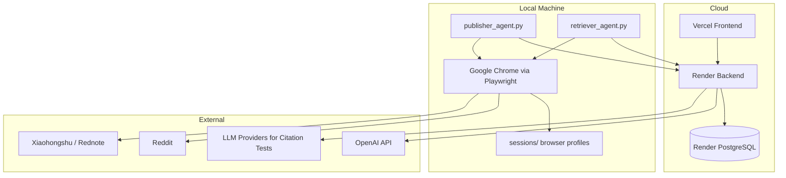
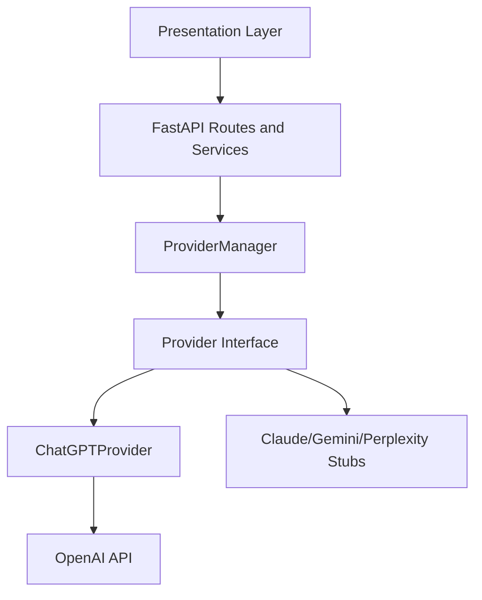
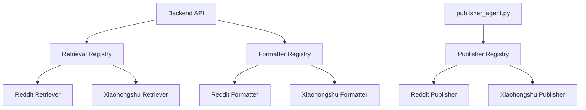

# Architecture

GEO Engine is a property-centric research platform composed of a React frontend, FastAPI backend, PostgreSQL database, local Playwright agents, and external platforms.

## System Diagram



## Frontend

Location:

```text
frontend/src/
```

Responsibilities:

- dashboard layout and navigation;
- Property selector and Property context;
- Website Audit page;
- Social Media Track page;
- Publishing Queue page;
- Citation Tests page;
- Content History page;
- Settings page.

The frontend should not own platform identity directly. It reads the selected Property and sends `property_id` to backend APIs.

## Backend

Location:

```text
backend/app/
```

Responsibilities:

- API routing;
- database models and persistence;
- content generation orchestration;
- platform retrieval orchestration;
- publishing job creation;
- citation testing;
- website audit;
- history events;
- experiment lab pipeline.

Routes live in:

```text
backend/app/api/v1/
```

Business logic lives in:

```text
backend/app/services/
```

## Future Multi-LLM Architecture

The platform is now provider-aware for LLM-generated artifacts. Records that
represent LLM work, such as generated content, FAQ sets, citation test runs,
citation results, experiment runs, and experiment campaigns, store a
`provider` value.

Current implementation:

- `chatgpt` is the default and only active provider.
- LLM execution is routed through the Provider Execution Layer.
- API requests may omit `provider`; the backend normalizes missing values to
  `chatgpt`.

Future providers such as Claude, Gemini, and Perplexity should be added behind
the provider interface without changing stored experiment, content, or citation
records. The current implementation does not call any non-OpenAI provider APIs.

## Provider Execution Layer

All LLM-backed execution flows now resolve a provider before calling a model.
ChatGPT remains the only concrete implementation, but service code no longer
constructs OpenAI clients directly.



Provider-aware execution currently covers:

- query generation;
- FAQ generation;
- content generation;
- GEO experiment LLM runs;
- citation tests;
- content optimization.

Future provider integrations should implement the same provider methods and
register with `ProviderManager`. Unsupported providers intentionally raise
`NotImplementedError` until their API integrations are added.

## Cross-Provider Evaluation

GEO Engine is being redesigned around comparing citation visibility across
multiple LLM providers rather than treating one provider response as the whole
result. The frontend now models results as provider comparison rows so citation
tests, Experiment Lab results, dashboard coverage, and history timelines can
all display one row per provider.

Current implementation:

- ChatGPT is the only active provider.
- Existing backend execution still produces ChatGPT results only.
- Cross-provider tables include ChatGPT results plus placeholders for future
  providers.

Future provider comparison targets:

- Claude
- Gemini
- Perplexity

Future integrations should populate the same provider comparison result shape
without changing retrieval, publishing, or experiment execution semantics.

## Database

Database: PostgreSQL.

Important tables include:

- `properties`
- `accounts`
- `contents`
- `faq_sets`
- `faqs`
- `platform_questions`
- `retrieval_tasks`
- `publishing_jobs`
- `history_events`
- `citation_test_runs`
- `citation_test_results`
- `website_audits`
- `website_pages`
- `website_audit_recommendations`

Alembic migrations live in:

```text
backend/alembic/
```

## Agents

Agents are local Python processes that poll the backend.

### Publisher Agent

File:

```text
backend/publisher_agent.py
```

Responsibilities:

- poll `/api/v1/publishing/pending`;
- claim queued publishing jobs;
- load platform publisher from registry;
- open local browser profile;
- prepare Review Mode;
- report completion or failure.

### Retriever Agent

File:

```text
backend/retriever_agent.py
```

Responsibilities:

- poll Xiaohongshu retrieval tasks;
- run local browser retrieval using the web profile;
- send retrieved normalized questions/posts back to backend;
- mark retrieval task complete or failed.

## Queues

The current queue pattern is database-backed polling.

Publishing queue:

```text
publishing_jobs
queued -> processing -> review_ready / published / failed
```

Retrieval queue:

```text
retrieval_tasks
queued -> processing -> completed / failed
```

State transitions should be visible in logs and, where relevant, History.

## Playwright

Playwright is used for browser work that needs real authenticated sessions:

- Reddit publishing review.
- Xiaohongshu web retrieval.
- Xiaohongshu Creator publishing review.

The project uses locally installed Chrome through Playwright `channel="chrome"` where possible.

## Session Management

Local profiles live under:

```text
sessions/reddit/profile/
sessions/xiaohongshu/web/profile/
sessions/xiaohongshu/creator/profile/
```

`SessionResolver` owns canonical paths. Browser profiles are machine-specific and must not be committed.

## Platform Architecture



A future platform should generally add one retriever, one formatter, one publisher, and documentation.

## Render

Render hosts the backend API and connects to PostgreSQL. Render does not run local browser profiles and should not perform browser publishing. Browser work belongs to local agents.

Render needs backend environment variables such as:

```text
OPENAI_API_KEY
DATABASE_URL
BACKEND_URL
```

Reddit and Xiaohongshu browser authentication are not stored on Render.

## Vercel

Vercel hosts the frontend. It calls the backend API and displays property-scoped data.

## Experiment Lab

The Experiment Lab reproduces the Princeton GEO paper workflow as an academic benchmark. It is separate from publishing workflows and should preserve paper fidelity where possible.

Core modules:

```text
backend/app/experiment/
backend/app/ge/
backend/app/evaluation/
backend/app/storage/
```
