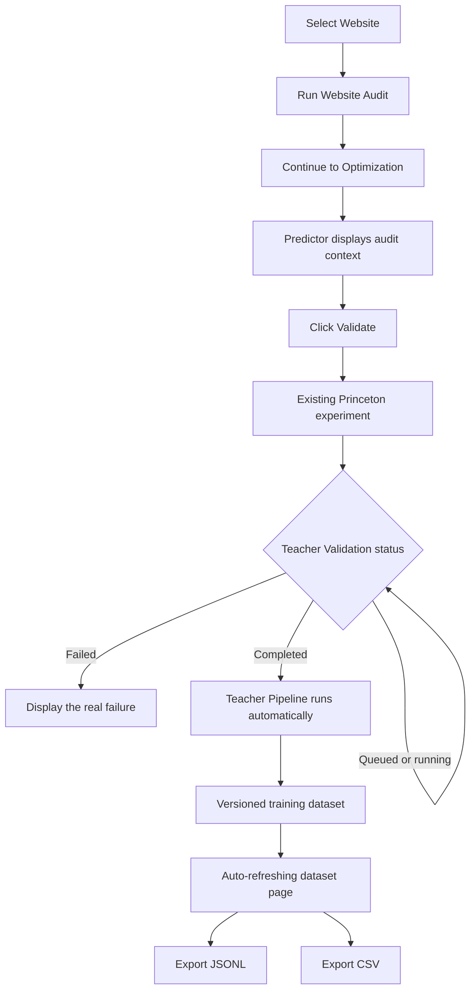

# GEO Platform Demo Workflow

## Purpose

The Demo Sprint connects the existing Website Audit, Predictor placeholder, Princeton experiment runner, Teacher Pipeline, training dataset, and dataset exports into one web-interface workflow. It does not add prediction, model training, Qwen, Llama, LoRA, or new research methodology.

## Demo flow

## 1. Website Audit

1. Select a property in the normal property selector.
2. Open **Website Audit**.
3. Click **Analyze Website**.
4. After the stored audit returns `completed`, the page displays **Continue to Optimization**.
5. Clicking it opens Predictor with these values passed automatically:
   - `website_id`;
   - `audit_id`;
   - structured `website_features`;
   - structured `optimization_opportunities`.

The URL retains the website and audit identifiers so refreshing Predictor reconstructs the same context from the API. No audit value needs to be copied into another page.

## 2. Optimization placeholder

Predictor remains the existing transparent placeholder. It does not calculate a prediction.

The **Optimization Context** panel displays:

- website and audit identifiers;
- every received feature label;
- every received optimization opportunity;
- a single **Validate** action.

The first stored optimization opportunity selects an existing Princeton strategy through a fixed integration mapping:

| Audit opportunity category | Existing strategy |
|---|---|
| FAQ opportunities | `easy_to_understand` |
| Internal-link suggestions | `citation` |
| Missing GEO topics | `authoritative` |
| Missing pages | `fluency` |
| Content recommendations | `authoritative` |

This mapping only selects an already implemented strategy. It does not predict impact or modify the strategy implementation.

## 3. Teacher Validation

Clicking **Validate** submits the existing Experiment Lab run API in the background with:

- the selected property ID;
- a traceable audit-specific experiment name and description;
- one audit-derived query;
- `original` as the baseline;
- the mapped existing strategy as treatment;
- the existing random seed, temperature, response sampling, retrieval, rewrite, prompt, and evaluation implementations.

The professor never opens Experiment Lab. Predictor stores the experiment ID in the URL and polls the existing run-status API every two seconds.

The **Teacher Validation** panel shows:

- experiment ID;
- `Queued`, `Running`, `Completed`, or `Failed`;
- current strategy;
- current sample and total samples;
- progress bar while running;
- the real backend error if execution fails.

No fake success or placeholder experiment output is shown.

## 4. Teacher Pipeline

When the experiment commits a completed result, `ExperimentRepository.mark_completed()` automatically invokes the existing Teacher Pipeline. This happens after the scientific result is durably committed, so dataset processing cannot change a successful experiment into a failed experiment.

No command-line worker, manual migration, or separate Experiment Lab action is required during the demo. Collection remains idempotent through the existing unique experiment-run provenance constraints.

After Teacher Validation reports `Completed`, the interface automatically opens **Teacher Pipeline**. A manual **View Training Dataset** button is also visible during the brief completed state.

## 5. Training Dataset

The Teacher Pipeline page refreshes every three seconds and displays:

- pipeline status;
- dataset version;
- training sample count;
- latest processed experiment;
- teacher model identifiers;
- experiment count and metric version;
- pending completed experiments;
- recent immutable samples and provenance hashes.

The page is read-only. It does not expose model training.

## 6. Dataset export

When a Teacher dataset version exists, both actions are visible:

- **Export JSONL** — version metadata followed by immutable training-sample records;
- **Export CSV** — the same serialized sample fields, with structured objects encoded as JSON cells.

The export actions are disabled by absence, not by hidden state: they appear as soon as the automatically refreshed status reports a dataset version.

## Operational prerequisite

The workflow uses real external retrieval and model calls. A valid credential for the selected existing provider must be configured before the demo. Provider authentication and quota failures are shown as `Failed` in Teacher Validation; the interface does not replace them with mock data.

At the time this document was produced, the locally configured OpenAI credential returned HTTP 401. The integration path and failure handling are executable, but a successful live demonstration requires replacing that external credential with a valid one. The configured demo website also currently returns HTTP 404 for all audited paths; selecting a reachable property is recommended for a meaningful audit.

## Verification

- Frontend production build: passed.
- Frontend lint: passed.
- Backend compilation: passed.
- Backend unit tests: 22 passed.
- Rendered Audit -> Predictor handoff: verified in browser.
- Predictor audit context: verified with 15 features and 21 opportunities.
- Teacher Validation failed-state rendering: verified with a real HTTP 401 experiment failure.
- Teacher JSONL export route: HTTP 200.
- Teacher CSV export route: HTTP 200.
- No model training, prediction, mock response, or fake dataset was introduced.
