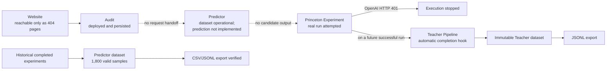
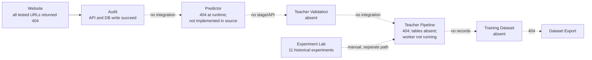

# GEO Platform End-to-End Workflow Review

## Professor demo verification — 2026-09-23 15:43 EDT

This is the latest review and supersedes all earlier verdicts below.

### Required answer

**Can a professor successfully complete the frozen GeoAIResume demo today without terminal intervention?**

**YES.** The complete workflow succeeded twice. The second run was performed through the browser from property selection and a fresh Audit through automatic Teacher Pipeline navigation. Both exports contain the resulting real Teacher samples.

### Stable demo scope

- Property 1: `GeoAIResume`.
- The originally stored `geoairesume-web-six.vercel.app` deployment is deleted.
- The real source repository is `https://github.com/MelanthaChen/geoairesume-web`.
- The stable local demo target at `http://127.0.0.1:8000/` serves the repository's real `Resume Gap Explanation Guide` text and enforces its frozen hash.
- Frozen query: `how to explain gaps in employment on your resume`.
- Four real reference snapshots are loaded from the existing official GEO-Bench cache and verified by URL and SHA-256.
- This workflow is labeled `princeton-style-frozen-new-website-demo-validation-v1`, not GEO-Bench replication.
- Only property 1 with the exact configured demo domain can use this pack. All other websites retain the separate live-retrieval architecture.

### Two-run results

| Check | Run 1 | Run 2 |
|---|---|---|
| Fresh audit | Audit 2 completed | Audit 3 completed through UI |
| Experiment | 1 completed | 2 completed through UI |
| Source count | 1 target + 4 references | 1 target + 4 references |
| Selected target | Rank 1 GeoAIResume | Rank 1 GeoAIResume |
| Baseline answers | 5 completed | 5 completed |
| Treatment answers | 5 completed | 5 completed |
| Baseline target equals snapshot | Yes | Yes |
| Reference hashes unchanged | Yes | Yes |
| Aggregate visibility delta | `+0.3181716` | `+0.1439574` |
| Teacher samples added | 5 | 5 |
| Dataset version | `teacher-dataset-v000001` | `teacher-dataset-v000002` |

Run 2 per-answer visibility deltas were `+0.169453`, `+0.062198`, `+0.149194`, `+0.170378`, and `+0.168564`. These are evaluated OpenAI Teacher outputs, not fabricated scores.

### Browser behavior verified

1. Property selector changed from Python to GeoAIResume.
2. Website Audit displayed property 1 and the local stable URL.
3. Analyze Website created audit 3 and displayed 15 features and 18 opportunities.
4. Continue to Optimization navigated to `/predictor?website_id=1&audit_id=3`.
5. Predictor displayed the correct website/audit IDs and received evidence counts.
6. Validate created experiment 2 and displayed Running/sample progress.
7. No Experiment Lab or worker interaction occurred.
8. On completion, the browser automatically navigated to `/teacher-pipeline?experiment_id=2`.
9. Teacher Pipeline displayed Ready, 10 samples, two experiments, dataset `teacher-dataset-v000002`, last experiment 2, and zero pending experiments.
10. JSONL and CSV export links were visible.

### Persistence and export verification

- Both experiment queries persisted policy version, audit ID, target rank, retrieval provider, frozen timestamp, and audit evidence.
- All five document snapshots and hashes were persisted on both experiments.
- Each experiment persisted 10 completed runs and per-answer metrics.
- Teacher samples explicitly identify the audited rank-1 target and the ordered four references.
- JSONL export returned HTTP 200 with dataset metadata plus 10 training samples; five have experiment ID 2.
- CSV export returned HTTP 200 with 10 data rows; five have experiment ID 2.
- Latest dataset version is `teacher-dataset-v000002` with 10 samples across two experiments.

### Verification suite

- All 22 backend tests pass.
- Frontend TypeScript and production build pass.
- Database migration remains at `20260923_0020` head.
- Frozen target and four reference integrity checks pass.

---

## Controlled new-website validation rerun — 2026-09-23 14:45 EDT

This is the latest review and supersedes all earlier verdicts below.

### Required answer

**Can a professor successfully complete a full demo of the GEO platform today?**

**NO.** The corrected controlled-intervention workflow is deployed and its database migrations are applied, but the local runtime lacks both required Google Custom Search settings. The live backend now stops with a clear HTTP 503 configuration error instead of silently using Google HTML parsing. Consequently no real four-reference set, experiment, Teacher sample, dataset version, or non-empty export could be generated in this environment.

### Live test identity

| Item | Value |
|---|---|
| Public website | `https://www.python.org/` |
| Property | ID 2, `Python` |
| Audit | ID 1, completed during this rerun |
| Audit result | Score 81; 20 pages; 7 evidence-backed opportunities |
| Frontend | `http://127.0.0.1:5173`, HTTP 200 |
| Backend | `http://127.0.0.1:8000`, updated process |
| Database migration | `20260923_0020` applied |

No mock responses, fabricated documents, backdated audits, or manually created experiment/sample records were used.

### Stage results

| Stage | Result | Evidence |
|---|---|---|
| Website | Pass | Public Python website responded and was audited |
| Audit | Pass | `POST /api/v1/audit/run` HTTP 200; audit 1 persisted with 20 pages and 7 opportunities |
| Continue to Optimization | Pass by implementation/build verification | Existing route and audit handoff retained; frontend production build passes |
| Predictor placeholder | Pass by implementation/build verification | Existing audit context/Validate UI retained; no inference added |
| Teacher Validation request | **Blocked** | `POST /api/v1/experiment-lab/teacher-validation` returned HTTP 503 |
| Five-source freeze | Not reached | Provider credentials are validated before retrieval; no HTML fallback used |
| Baseline/treatment | Not reached | No source set was fabricated |
| Teacher Pipeline | Not reached | Correctly remains empty for property 2 |
| Dataset version | Not generated | No valid completed experiment exists |
| JSONL/CSV sample export | Not verifiable | No real Teacher sample exists |

### Exact live failure

**Endpoint:** `POST /api/v1/experiment-lab/teacher-validation`

**HTTP status:** 503
**Backend response:**

> Google Custom Search is not configured. Set both GOOGLE_SEARCH_API_KEY and GOOGLE_SEARCH_ENGINE_ID. Teacher Validation does not use the Google HTML fallback.

**Frontend behavior:** the existing Predictor validation handler displays the backend `detail` message in its Teacher Validation error area. It does not create an experiment, navigate forward, or claim a dataset was generated.

**Classification:** external runtime configuration blocker. Both Google settings are absent from the local backend environment. This is intentionally fail-closed behavior required by the corrected methodology.

### Corrected implementation verified

- Audit validation now uses a dedicated `/teacher-validation` API instead of submitting a document-less generic custom experiment.
- Query generation is deterministic and versioned as `audit-evidence-query-v1`.
- The backend snapshots an audited page and fixes it at rank 1 with role `audited_target`.
- Retrieval is restricted to four distinct external references and uses the existing provider abstraction.
- Google API credentials are mandatory for this workflow; brittle HTML parsing is disabled.
- Query, source ordering, target index, provider/timestamp, audit evidence, full snapshots, and SHA-256 hashes have persistence fields.
- The existing baseline path returns the original target unchanged; treatment rewrites only the selected rank-1 target.
- The existing evaluator measures each answer against the selected audited target.
- Teacher provenance includes the ordered five-source set, and the sample records per-answer deltas plus repeated-answer aggregate deltas.
- Teacher Pipeline rejects new-website experiments unless rank 1 is the audited target and exactly four references exist.
- The exact source audit is used for sample construction.
- Successful completion still triggers Teacher Pipeline automatically, and dataset/export APIs remain connected.

### Verification performed

- Alembic upgraded the live PostgreSQL database through `20260923_0020`.
- Updated backend restarted successfully and serves the new endpoint.
- All 22 backend tests pass.
- Frontend TypeScript and production Vite build pass.
- Live property creation and a real Python.org audit succeeded.
- Live Teacher Validation produced the expected fail-closed HTTP 503.
- Teacher Pipeline status for property 2 remained empty; no invalid sample was admitted.

### Remaining blocker

1. Configure valid `GOOGLE_SEARCH_API_KEY` and `GOOGLE_SEARCH_ENGINE_ID` values in the backend runtime, restart it, and rerun Validate. This single external prerequisite blocks all remaining live assertions: four-reference freezing, baseline/treatment execution, measured deltas, automatic sample creation, dataset versioning, and non-empty JSONL/CSV exports.

### Nine requested determinations

1. **Was the audited website definitely the optimized target?** Not in a completed live experiment; execution stopped before retrieval. The corrected path enforces the audited page at rank 1 and rejects any resulting sample that violates it.
2. **Were exactly four external references frozen?** No live set was frozen because the configured provider is unavailable.
3. **Was only the audited target changed between baseline and treatment?** Not exercised live; the implemented prompt path changes only the selected rank-1 target and keeps the four frozen references unchanged.
4. **Was a real delta measured for the audited target?** No.
5. **Was a Teacher training sample generated?** No.
6. **Was a dataset version generated?** No.
7. **Did JSONL export contain the sample?** No sample exists to export.
8. **Did CSV export contain the sample?** No sample exists to export.
9. **Can the professor successfully complete the demo today?** **No**, not until the required Google Custom Search credentials are configured.

---

## Live end-to-end rerun — 2026-09-23 14:09 EDT

This is the latest review and supersedes all earlier verdicts below.

### Required answer

**Can a professor successfully complete a full demo of the GEO platform today?**

**NO.** The browser workflow succeeds from property creation through Audit, automatic Audit-to-Predictor handoff, and submission of Teacher Validation. Teacher Validation then fails before generation because the unconfigured Google HTML search fallback cannot parse the current Google result markup. No Princeton runs are produced, so Teacher Pipeline correctly has no eligible evidence and cannot create a dataset version.

### Test identity

| Item | Live value |
|---|---|
| Public website | `https://www.python.org` |
| Property | ID 2, `Python.org Demo` |
| Audit | ID 2 |
| Teacher Validation experiment | ID 13 |
| Browser | Live frontend at `http://127.0.0.1:5173` |
| API | Live backend at `http://127.0.0.1:8000` |

The property was created from the web interface using **Add Property**. The audit, continuation, Predictor context, and Validate action were then exercised as a normal user. Experiment Lab, the command line, migrations, and the worker were not used to advance the browser workflow.

### Stage results

| Stage | Frontend | Backend API | Database | Handoff/result |
|---|---|---|---|---|
| Website | Pass | `POST /api/v1/properties` returned HTTP 200 | Property 2 persisted | Became active workspace automatically |
| Audit | Pass | `POST /api/v1/audit/run` returned HTTP 200; latest endpoint returned HTTP 200 | Audit 2 and 20 page rows persisted | Passed website 2, audit 2, 15 features, and 7 opportunities |
| Continue to Optimization | Pass | Latest-audit fetch returned HTTP 200 | Read-only | Browser navigated to `/predictor?website_id=2&audit_id=2` |
| Predictor placeholder | Pass | Predictor status/dataset APIs operational | Existing Predictor dataset remained available | Displayed all 15 features and 7 opportunities without re-entry |
| Teacher Validation submission | Pass | `POST /api/v1/experiment-lab/run` returned HTTP 200 | Experiment 13 persisted with `property_id=2` | Browser stored `experiment_id=13` and began polling |
| Teacher Validation execution | **Fail** | `GET /api/v1/experiment-lab/runs/13` returned HTTP 200 with `status=failed` | Experiment 13 is failed; zero experiment runs | No completed experiment to pass downstream |
| Teacher Pipeline | Not reached | Status endpoint returned HTTP 200 | Zero Teacher samples for property 2 | Automatic completion hook was not invoked because the experiment did not complete |
| Training Dataset | Not reached | Status endpoint returned HTTP 200 with `dataset_version=null` | Zero dataset versions and zero dataset members | No version generated |
| JSONL export | Endpoint pass, workflow fail | HTTP 200, `empty.jsonl`, 36 bytes | No dataset source records | No real dataset was exported |
| CSV export | Endpoint pass, workflow fail | HTTP 200, `empty.csv`, 291 bytes | No dataset source records | Header-only empty artifact |

### Audit evidence

The live Python.org audit completed successfully and displayed:

- overall GEO score: 81/100;
- 20 crawled pages;
- 10 pages with HTTP 200;
- 8,007 extracted words;
- 15 structured features;
- 7 optimization opportunities;
- 10/10 successful pages with H1 coverage;
- 520 external and 1,296 internal references.

The frontend displayed **Continue to Optimization** and stated that website 2, audit 2, 15 features, and seven opportunities were ready. Predictor then displayed those exact counts and identifiers.

### Exact failure

**Failing component:** `GoogleSearchProvider._search_google_html()` during the retrieval phase of the existing Princeton experiment.

**HTTP status:**

- experiment submission: HTTP 200;
- experiment-status polling: HTTP 200;
- experiment result: application status `failed`;
- upstream Google HTML request: HTTP 200, but its response markup did not match the parser.

**Backend error:**

> Google HTML fallback parsed zero search results. Reason: response contained anchors, but none matched the expected Google '/url?q=' result-link pattern. Configure GOOGLE_SEARCH_API_KEY and GOOGLE_SEARCH_ENGINE_ID for reliable retrieval.

**Frontend behavior:** Predictor displayed the Teacher Validation panel with experiment 13, status **Failed**, strategy `original`, sample `0/5`, and the complete backend error. It did not navigate to Teacher Pipeline or claim success.

**Classification:** Primary blocker is **configuration**: `GOOGLE_SEARCH_API_KEY` and `GOOGLE_SEARCH_ENGINE_ID` are absent, so the platform uses the unreliable HTML fallback. The fallback parser's dependence on the old `/url?q=` link shape is also an **implementation fragility**, but no application logic was changed during this rerun.

OpenAI authentication was not the cause. Immediately before this rerun, both `gpt-4.1-mini` and the Teacher Validation model `gpt-3.5-turbo` completed authenticated calls successfully. Experiment 13 failed before its first OpenAI generation request.

### Database verification

| Record | Count/state |
|---|---:|
| Property 2 | 1 |
| Audits for property 2 | 1 |
| Website pages for audit/property 2 | 20 |
| Experiment 13 | `failed`, property 2 |
| Experiment runs for experiment 13 | 0 |
| Teacher samples for property 2 | 0 |
| Teacher dataset versions | 0 |
| Teacher dataset members | 0 |

### Remaining blockers in priority order

1. Configure valid `GOOGLE_SEARCH_API_KEY` and `GOOGLE_SEARCH_ENGINE_ID` values for the backend so the Princeton experiment can obtain its required top-five real documents without relying on Google HTML parsing.
2. Rerun **Validate** after retrieval credentials are available and confirm experiment 13's replacement completes all baseline and treatment samples.
3. Verify the already-wired automatic completion hook creates Teacher samples and the first immutable dataset version.
4. Reverify that JSONL and CSV downloads contain the generated dataset rather than the current empty artifacts.

---

## Remediation rerun — 2026-09-23

This section supersedes the original runtime findings below. The original review is retained as the pre-remediation baseline.

### Current verdict

**NO — the full workflow still cannot be completed with real data today.**

The deployment and persistence blockers have been fixed, but an end-to-end success cannot be asserted honestly under the stated constraints. The current Predictor is deliberately a nonfunctional foundation, and the only configured real generation provider rejected its credential.



### Blockers fixed

1. **Runtime equals source:** the stale API process was replaced with the current checked-out backend source.
2. **Migrations:** the live API database was backed up and upgraded from `20260820_0016` through `20260923_0019` (head).
3. **Routes:** live OpenAPI now exposes Audit, all five Predictor routes, all three Teacher Pipeline routes, and all fourteen Experiment Lab routes.
4. **Database alignment:** the API and all remediation processing used the same live `DATABASE_URL`; no work was written to the empty CLI database.
5. **Audit contract:** the live Audit response now includes `website_profile`, `strengths`, `weaknesses`, `website_features`, and `optimization_opportunities`.
6. **Predictor dataset:** existing completed experiments were backfilled through the real dataset builder. The live dataset contains 1,800 valid samples, zero invalid samples, ten strategies, and three experiments.
7. **Predictor export:** the live export endpoint returned HTTP 200 and produced a 53,394,211-byte CSV from those real samples.
8. **Teacher API and tables:** Teacher status, samples, and export routes are deployed; all migration `0019` tables exist.
9. **Automatic experiment-to-teacher handoff:** successful experiment completion now invokes the existing Teacher Pipeline after the scientific result is committed. Dataset failure remains best-effort and cannot alter experiment results.
10. **Scalability defect:** Predictor and Teacher collection now use select-in loading rather than Cartesian joined loading across multiple collections.
11. **Frontend verification:** `/audit`, `/predictor`, `/teacher-pipeline`, and `/experiment-lab` return HTTP 200. Frontend build and lint pass.
12. **Backend verification:** all 22 existing backend unit tests pass.

### Real-data execution performed

- The prior real website audit remains persisted for property 1. Every crawled URL returned HTTP 404; no fake page content was substituted.
- A new experiment (ID 12) was submitted through `POST /api/v1/experiment-lab/run` after the audit.
- It used one persisted GEO-bench query, its five persisted source documents, strategies `original` and `fluency`, model `gpt-4.1-mini`, and the real ChatGPT provider integration.
- The experiment was linked to property 1 and entered the normal background execution path.
- The first real model call failed with OpenAI HTTP 401 (`invalid_api_key`). The experiment was correctly marked failed and produced zero runs. The credential value is intentionally not recorded here.
- No mock provider, fake response, fabricated experiment row, backdated audit, or manually constructed Teacher sample was used.

### Remaining blockers in execution order

1. **Website content is unavailable:** the configured property returns 404 for all 12 audited URLs. The Audit is real, but it has no successful page content.
2. **Audit -> Predictor remains disconnected:** there is no frontend action or backend contract that passes an audit, feature vector, or optimization opportunity into `/predictor/predict`.
3. **Predictor is not executable as an Optimization Model:** `PredictorService.predict()` deliberately returns `status: not_implemented`, no prediction, and no candidate rewrite. The backend tests explicitly enforce this behavior.
4. **A real experiment cannot currently execute:** the only configured executable LLM provider is ChatGPT, and its configured OpenAI credential returns HTTP 401. Claude and Gemini are explicitly unimplemented; Perplexity has no saved browser profile.
5. **No Predictor -> Experiment handoff exists:** because Predictor emits no candidate, no API or frontend action can launch the corresponding baseline/treatment experiment automatically.
6. **Teacher dataset cannot yet be generated from a qualifying run:** historical experiments predate the first Audit, and the only post-audit real experiment failed before creating runs. Preserving the time relationship is required for provenance.
7. **Teacher export has no version to export:** the endpoint exists, but an immutable Teacher dataset version is created only after at least one valid post-audit completed experiment.

### Required answer after rerun

**Can a user successfully complete the full GEO workflow today using the current platform (assuming Predictor temporarily represents the future model)?**

**No.** Deployment, migrations, routes, database alignment, real Predictor dataset collection, and exports are operational. A YES requires both (a) a real, non-placeholder Predictor result and automated Audit handoff, and (b) a valid configured generation provider so a post-audit Princeton experiment can complete. Implementing a Predictor would be new model functionality, which this task explicitly forbids; replacing or obtaining a valid provider credential requires external user/account action.

---

## Original pre-remediation review

**Review date:** 2026-09-23  
**Workflow tested:** Website -> Audit -> Predictor -> Teacher Validation -> Teacher Pipeline -> Training Dataset -> Dataset Export  
**Constraint:** The current Predictor was treated as the temporary Optimization Model. No fixes or new functionality were implemented.

## Final verdict

**FAIL — the workflow is not executable end to end.**

Only the Website Audit stage currently completes a real frontend/API/database round trip. The Predictor is an explicit nonfunctional placeholder, Teacher Validation does not exist as a product stage, the Teacher Pipeline is not deployed or migrated in the running environment, there is no automatic orchestration between stages, and no training dataset or export exists at runtime.

The diagram in the requested workflow is therefore a target architecture, not the current platform's executable data flow.



## 1. Test environment and methodology

### Runtime inspected

- Frontend: `http://127.0.0.1:5173`, HTTP 200.
- Backend: `http://127.0.0.1:8000`, `GET /health` returned HTTP 200 and `{"status":"healthy"}`.
- Frontend and backend were already running before the review.
- Active property: ID `1`, `GeoAIResume`, domain `geoairesume-web-six.vercel.app`.
- The frontend was inspected through the rendered browser UI at `/audit`, `/predictor`, and `/teacher-pipeline`.
- Backend routes were verified through live HTTP requests and the running service's OpenAPI document.
- Database schemas/counts were inspected with read-only SQL after the real Audit request.
- Frontend `npm run build` and `npm run lint` both passed.
- Source-level integrations were traced across frontend API clients, backend routers/services, Predictor code, Teacher Pipeline code, and experiment persistence.

### Mutating test performed

One genuine `POST /api/v1/audit/run` request was executed for the configured property. It used the configured public website rather than fixtures or fabricated values. It created:

- 1 completed audit;
- 12 website-page records;
- 21 audit-recommendation records.

No Predictor, validation, experiment, Teacher Pipeline, training, or export records were fabricated to simulate downstream success.

### Important environment split

The running API process and local CLI/worker configuration resolve to different PostgreSQL connection strings.

| Environment | Migration | Experiments | Experiment runs | Audit after test | Teacher tables |
|---|---:|---:|---:|---:|---|
| Running API database | `20260820_0016` | 11 | 1,816 | 1 | Missing |
| CLI/`backend/.env` database | `20260903_0018` | 0 | 0 | 0 | Missing |

Connection strings were compared by hash and not exposed. This is a critical integration result: starting `teacher_pipeline_agent.py` from the local shell with its normal configuration would not process the experiments visible to the running API.

---

## 2. Overall test matrix

| Stage | Frontend | Backend API | Database | Passes data forward | No manual intervention | No placeholder/fake data | Stage result |
|---|---|---|---|---|---|---|---|
| Website | Property UI works | Property API works | Property exists | Domain passes to Audit | Property already selected | Real configured domain | **Fail:** website returned 404 for every audited URL |
| Audit | Page/button/results work | Run/latest APIs return 200 | Audit/pages/recommendations persisted | No connection to Predictor | User must explicitly run audit | Real crawl data; no fake values | **Partial pass**, handoff fails |
| Predictor | Page renders degraded state | Runtime routes return 404 | Predictor dataset table absent in runtime DB | Does not consume Audit; produces no output | Manual demo form only | Source explicitly returns `not_implemented` | **Fail** |
| Teacher Validation | No page/action | No API/service | No validation tables | No handoff | Impossible | N/A | **Absent** |
| Teacher Pipeline | Page renders error state | Runtime routes return 404 | Teacher tables absent | Source consumes Audit + Experiment, not Predictor/Validation | Separate worker must be started manually | No fabricated samples | **Fail** |
| Training Dataset | Summary UI depends on failed API | No usable runtime dataset API | Both legacy and teacher sample tables absent in API DB | Nothing available to export | Migration/worker required | No records | **Fail** |
| Dataset Export | Export link hidden because no version | Runtime export returns 404 | No dataset/version/members | Terminal stage unreachable | Requires deployment and generated dataset | No fake export | **Fail** |

---

# 3. Stage-by-stage integration results

## Stage 1 — Website

### Observed behavior

The property selector loaded `GeoAIResume` and passed its configured domain to the Website Audit page. The domain was real, not fixture data.

The audit crawler attempted the base URL and eleven known site paths. All 12 stored page records returned HTTP 404 and contained zero words, zero internal references, zero external references, and no H1.

### Verification criteria

1. **Frontend works:** Pass. The property selector and domain display rendered correctly.
2. **Backend API works:** Pass. Property listing returned HTTP 200.
3. **Database updates correctly:** Not applicable until Audit; the property already existed.
4. **Data passes forward:** Pass to Audit. The property ID/domain reached the Audit request.
5. **No manual intervention:** Pass for property context because it was already selected; changing/creating properties remains a user action.
6. **No placeholder/fake data:** Pass. The configured public domain was used.

### Stage conclusion

**Operational failure:** the configured website did not provide analyzable content. The Audit system still completed, but its zero-valued result describes 404 responses rather than a usable website.

### Missing integration

- A preflight check does not block or clearly classify an unreachable/all-404 property before recording a “completed” audit.
- No workflow gate prevents downstream stages from using an audit with zero successful pages.

---

## Stage 2 — Audit

### Frontend result

The `/audit` page rendered, including the property context, Analyze Website button, overview cards, evidence sections, and page evidence list. After the real API run and asynchronous load, it displayed:

- 0/100 existing audit scores;
- 12 crawled pages;
- the audit timestamp;
- each 404 page record.

The current frontend expects the redesigned structured fields (`website_profile`, `strengths`, `weaknesses`, `website_features`, and `optimization_opportunities`). The running backend is older and returned only the legacy contract. Consequently:

- overview values fell back to legacy score fields;
- structured strengths/weaknesses/features/opportunities stayed empty;
- page evidence still displayed.

### Backend result

- `POST /api/v1/audit/run`: HTTP 200.
- `GET /api/v1/audit/latest?property_id=1`: HTTP 200.
- Response: completed audit ID 1, 12 pages, overall score 0.
- The live response included legacy fields but not the five redesigned structured fields.

### Database result

In the running API database:

- `website_audits`: 1 row;
- `website_pages`: 12 rows;
- `website_audit_recommendations`: 21 rows;
- audit status: `completed`;
- property linkage: correct (`property_id=1`).

### Handoff to Predictor

**No handoff exists.**

The Audit page stores its result and displays it. It does not call Predictor. The Predictor request contract accepts:

- query;
- strategy;
- original document;
- modified document.

It does not accept:

- audit ID;
- property ID;
- website profile;
- website features;
- optimization opportunity ID.

### Verification criteria

1. **Frontend works:** Partial pass; legacy API fallback works, but redesigned sections cannot populate against the running backend.
2. **Backend API works:** Pass for run/latest.
3. **Database updates correctly:** Pass.
4. **Data passes forward:** Fail. No Audit -> Predictor integration.
5. **No manual intervention:** Fail. User must navigate elsewhere and manually re-enter Predictor inputs.
6. **No placeholder/fake data:** Pass for Audit; all values came from the real crawl.

### Exact missing pieces

- **Missing API connection:** no endpoint/action converts an audit or opportunity into a Predictor request.
- **Missing frontend action:** no “Evaluate with Predictor” or equivalent action on Audit/opportunity records.
- **Missing backend integration:** Predictor has no audit/feature/opportunity input contract or audit repository lookup.
- **Deployment mismatch:** running backend has not loaded the redesigned Audit response implementation.

---

## Stage 3 — Predictor as temporary Optimization Model

### Frontend result

The `/predictor` page rendered. It clearly stated that no training or prediction model is active. The dataset panel showed “Dataset summary is unavailable from the current backend,” the Request Prediction button was disabled without manually entered documents, and no prediction was displayed.

### Backend result

Against the running service:

- `GET /predictor/status`: HTTP 404.
- `GET /predictor/dataset`: HTTP 404.
- OpenAPI contained zero `/predictor` routes.

In current source, the routes exist, but behavior remains placeholder-only:

- `POST /predictor/train` validates and echoes configuration, returning `not_implemented`.
- `POST /predictor/predict` returns `not_implemented` and no prediction.
- no trained model artifact is loaded;
- no inference or optimization is performed.

### Database result

The running API database is at migration `0016`. `training_samples`, introduced by later migrations, is missing. No Predictor dataset can exist there.

### Handoff to Teacher Validation

**No handoff exists, and Predictor emits no result to validate.**

### Verification criteria

1. **Frontend works:** Partial pass; the page renders an honest unavailable state.
2. **Backend API works:** Fail at runtime (404); source implementation is nonfunctional by design.
3. **Database updates correctly:** Fail/not applicable; runtime table is missing and prediction writes nothing.
4. **Data passes forward:** Fail. Predictor consumes neither Audit data nor produces a prediction/candidate.
5. **No manual intervention:** Fail. Demo inputs require manual entry even if the endpoint were available.
6. **No placeholder/fake data:** Fail as an executable stage because the implementation is explicitly a placeholder. It does not fabricate predictions, which is correct, but it also cannot satisfy the workflow.

### Exact missing pieces

- **Missing runtime APIs:** `/predictor/status`, `/predictor/dataset`, `/predictor/predict`, and `/predictor/train` are not deployed in the running process.
- **Missing database migration:** Predictor `training_samples` table is absent in the API database.
- **Missing frontend action:** no Audit-derived request can populate/submit the Predictor.
- **Missing backend implementation:** no model, model artifact, feature adapter, inference implementation, or prediction persistence.
- **Missing output contract:** no candidate optimization/result ID that Teacher Validation could consume.

---

## Stage 4 — Teacher Validation

### Result

**This stage does not exist in the current product architecture.**

Repository search found no Teacher Validation:

- frontend route/page;
- frontend API client/action;
- backend router/service;
- database model/table;
- validation record tied to Predictor output;
- lifecycle state or approval gate.

The repository does contain:

- objective experiment evaluation;
- optional subjective experiment evaluation;
- a standalone subjective-evaluator bridge-validation research module;
- browser-account session validation.

None of these is a Teacher Validation stage between Predictor and Teacher Pipeline.

### Verification criteria

1. **Frontend works:** Fail; absent.
2. **Backend API works:** Fail; absent.
3. **Database updates correctly:** Fail; no schema.
4. **Data passes forward:** Fail; no validation artifact exists.
5. **No manual intervention:** Fail; impossible.
6. **No placeholder/fake data:** Not applicable because the stage is absent.

### Exact missing pieces

- **Missing API:** create/run/get Teacher Validation endpoints.
- **Missing frontend action:** no action to submit a Predictor result for validation and no status/results page.
- **Missing backend integration:** no validator consumes Predictor output; no validation policy or result is passed to Teacher Pipeline.
- **Missing database:** no validation run, judgment, decision, version, or provenance tables.
- **Missing workflow semantics:** no definition of what the teacher validates, pass/fail criteria, or how validation launches a Princeton experiment.

---

## Stage 5 — Teacher Pipeline

### Frontend result

The `/teacher-pipeline` page rendered, but displayed:

- “Teacher Pipeline status could not be loaded”;
- zero samples;
- no dataset version;
- no teacher model;
- no recent samples.

This is an error/fallback state, not a functioning stage.

### Backend result

Against the running service:

- `GET /api/v1/teacher-pipeline/status`: HTTP 404.
- `GET /api/v1/teacher-pipeline/dataset/export`: HTTP 404.
- OpenAPI contained zero Teacher Pipeline routes.

Current source includes these routes, but the running backend was not restarted/deployed with them.

### Database result

The following tables are absent in both inspected databases:

- `teacher_training_samples`;
- `teacher_dataset_versions`;
- `teacher_dataset_members`.

The running API database is at migration `0016`; the CLI database is at `0018`; the Teacher migration is `0019`.

### Source-level input mismatch

The Teacher Pipeline does **not** consume Predictor or Teacher Validation output. It independently scans:

- completed experiments;
- matching `original` and optimized experiment runs;
- the latest completed audit that predates the experiment completion.

Therefore the implemented source path is:

```text
Audit + manually/independently completed Experiment
    -> Teacher Pipeline worker
```

It is not:

```text
Audit -> Predictor -> Teacher Validation -> Teacher Pipeline
```

### Existing experiment incompatibility

The running API database contains 11 completed/historical experiments and 1,816 experiment runs, but the first audit was created during this review, after those experiments. Teacher Pipeline `_audit_for()` only selects an audit completed at or before the experiment completion time. The historical experiments therefore cannot produce Teacher samples from this new audit.

### Automation result

No `teacher_pipeline_agent.py` worker process was running. The worker must be started separately. There is no scheduler, API-triggered orchestration, durable job, or experiment-completion hook for this pipeline.

Additionally, launching the worker normally from the shell would use the CLI database, which contains zero experiments, rather than the running API database with 11 experiments.

### Verification criteria

1. **Frontend works:** Partial pass; page renders but API fails.
2. **Backend API works:** Fail at runtime (404).
3. **Database updates correctly:** Fail; tables are absent and no sample can be written.
4. **Data passes forward:** Fail; no Predictor/validation input and no samples.
5. **No manual intervention:** Fail; migration, backend restart/deploy, environment alignment, and worker startup are manual prerequisites.
6. **No placeholder/fake data:** Pass in the narrow sense that the pipeline does not invent samples; it produces none.

### Exact missing pieces

- **Missing runtime APIs:** Teacher Pipeline router is not loaded by the current process.
- **Missing database migration:** migration `0019` has not been applied.
- **Missing frontend action:** no workflow action launches/monitors processing for a specific validated candidate.
- **Missing backend integration:** no Predictor input, no Teacher Validation input, no experiment-launch orchestration, and no automatic worker scheduling.
- **Missing environment consistency:** API and worker/CLI databases differ.
- **Missing temporal data:** no pre-experiment audit exists for current historical experiments.

---

## Stage 6 — Training Dataset

### Result

No current runtime training dataset exists.

There are two separate source concepts:

1. legacy Predictor `training_samples`, populated after experiment completion in newer source;
2. Teacher Pipeline `teacher_training_samples` plus dataset versions/members.

Neither exists in the running API database. The CLI database has an empty legacy `training_samples` table but no Teacher tables and no experiments.

### Verification criteria

1. **Frontend works:** Fail as a live dataset view; pages show empty/unavailable state.
2. **Backend API works:** Fail at runtime; dataset endpoints are 404.
3. **Database updates correctly:** Fail; required tables/records are absent.
4. **Data passes forward:** Fail; there is nothing to export.
5. **No manual intervention:** Fail; requires migrations, correctly configured worker, qualifying audit/experiment pairs, and processing.
6. **No placeholder/fake data:** Pass; no fake rows were used.

### Exact missing pieces

- **Missing API connection:** no successful dataset status/list endpoint in the running backend.
- **Missing frontend action:** no usable dataset is shown because its source API is unavailable.
- **Missing backend integration:** no unified dataset authority; legacy Predictor samples and Teacher dataset versions are parallel systems.
- **Missing database state:** no Teacher sample/version/member tables or records.

---

## Stage 7 — Dataset Export

### Frontend result

The Teacher Pipeline Export JSONL action is only displayed when a dataset version exists. No version exists, so the action was unavailable.

The Predictor page displays export controls, but its dataset API is unavailable and no data exists.

### Backend result

- `GET /api/v1/teacher-pipeline/dataset/export`: HTTP 404.
- No export bytes or metadata record were produced.

### Database result

No dataset version or membership exists to export.

### Verification criteria

1. **Frontend works:** Fail for export; no actionable export is available.
2. **Backend API works:** Fail (404).
3. **Database updates correctly:** Read-only stage, but its required source records are absent.
4. **Data passes forward:** Fail; no downloadable dataset.
5. **No manual intervention:** Fail; all upstream deployment/processing prerequisites are unmet.
6. **No placeholder/fake data:** Pass; the system does not fabricate a downloadable dataset.

### Exact missing pieces

- Deployed Teacher Pipeline export route.
- Applied Teacher Pipeline migration.
- Generated dataset version and membership.
- Running, correctly configured worker.
- Complete upstream Audit -> Predictor -> Validation -> Experiment orchestration.

---

# 4. Handoff analysis

## Website -> Audit

**Connected.** Property ID/domain are passed correctly. The configured website itself is currently unusable because all tested URLs return 404.

## Audit -> Predictor

**Disconnected.** No frontend action, request contract, service call, foreign key, or pipeline job links the two.

## Predictor -> Teacher Validation

**Disconnected and nonfunctional.** Predictor returns no prediction; Teacher Validation does not exist.

## Teacher Validation -> Teacher Pipeline

**Disconnected.** No validation artifact exists, and Teacher Pipeline does not accept one.

## Teacher Pipeline -> Training Dataset

**Implemented only in undeployed source.** The independent worker can write Teacher samples/dataset versions after migrations, but it is not running, uses a different configured database by default, and cannot process the existing experiments because no qualifying pre-experiment audit exists.

## Training Dataset -> Dataset Export

**Implemented only in undeployed source.** The runtime route and tables do not exist.

---

# 5. Placeholder and real-data assessment

| Component | Assessment |
|---|---|
| Website | Real configured domain, but all responses were 404. |
| Audit | Real crawl and persisted database rows. No fabricated values. |
| Predictor UI | Honest placeholder/unavailable interface. |
| Predictor backend | Explicit `not_implemented`; no fake prediction returned. |
| Teacher Validation | Absent. |
| Teacher Pipeline | Source algorithm exists, but no runtime API/tables/records. |
| Dataset | No fake dataset used; no dataset exists. |
| Export | No fake export used; request returned 404. |

The platform correctly avoids fabricating successful output, but that means the requested complete workflow cannot execute.

---

# 6. Execution-order blockers

The blockers below are ordered as a user encounters them.

1. **Configured website unavailable:** all 12 audited URLs returned HTTP 404, leaving no real website content or structured features.
2. **Audit runtime/source contract mismatch:** the running backend returns the legacy audit schema, so the redesigned frontend cannot receive `website_profile`, strengths, weaknesses, website features, or structured optimization opportunities.
3. **No Audit -> Predictor action:** Audit has no frontend control or backend call that sends audit features/opportunities to Predictor.
4. **Predictor APIs not deployed:** runtime `/predictor/status`, `/predictor/dataset`, `/predictor/train`, and `/predictor/predict` are unavailable (404).
5. **Predictor database migration absent:** the running API database is at `0016`; `training_samples` does not exist.
6. **Predictor is not an Optimization Model:** current source returns `not_implemented`, has no trained artifact, performs no inference, and persists no candidate/result.
7. **Predictor input contract is incompatible with Audit:** it expects manually entered query/strategy/original/modified documents, not audit IDs, website features, or opportunities.
8. **Teacher Validation is absent:** no page, API, service, database record, policy, or result contract exists.
9. **No validation -> Princeton experiment orchestration:** nothing converts a Predictor candidate into a controlled baseline/treatment experiment.
10. **Experiments remain a separate manual workflow:** a user must independently configure/run Experiment Lab; it is not in the tested chain's frontend flow.
11. **Teacher Pipeline APIs not deployed:** runtime status/samples/export routes return 404.
12. **Teacher Pipeline migration absent:** `teacher_training_samples`, `teacher_dataset_versions`, and `teacher_dataset_members` do not exist.
13. **Teacher Pipeline worker not running:** collection requires manually starting a separate polling process.
14. **API/worker database configuration mismatch:** the running API and local worker point to different databases; the worker's default database has zero experiments.
15. **Historical experiments have no qualifying audit:** the current audit postdates the existing experiments, while Teacher Pipeline requires an audit completed before experiment completion.
16. **Teacher Pipeline bypasses Predictor and Teacher Validation:** its source consumes Audit + completed Experiment directly, so even a deployed worker would not execute the requested stage order.
17. **No runtime training dataset exists:** neither legacy Predictor samples nor Teacher dataset records are available in the API database.
18. **Dataset export is unreachable:** no dataset version exists and the runtime export endpoint returns 404.

---

# 7. Answer to the required question

## Can a user successfully complete the full GEO workflow today using the current platform (assuming Predictor temporarily represents the future model)?

**No.**

The user can select a website and run a real Audit, but cannot pass that audit to a working Predictor. The Predictor is both undeployed in the current backend process and explicitly unimplemented in current source. Teacher Validation is absent. Teacher Pipeline is undeployed, unmigrated, unautomated, pointed at a different database when launched normally, and does not consume Predictor or validation output. Consequently, no Teacher training dataset or dataset export can be produced through the requested workflow today.
