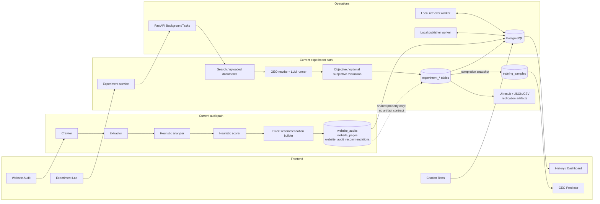
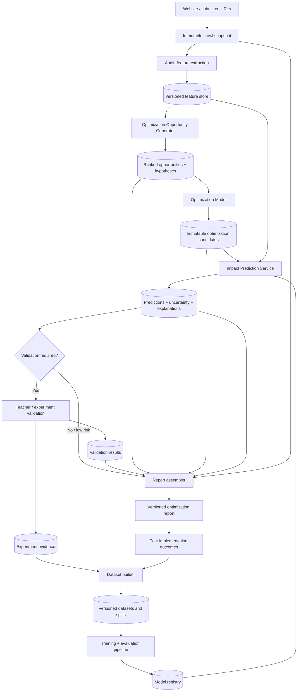

# GEO Platform Evolution Plan

**Status:** Architecture proposal only; no implementation is included.  
**Audit basis:** Repository state reviewed on 2026-09-20.  
**Scope:** `frontend/src`, `backend/app`, database migrations through `20260903_0018_predictor_dataset_pipeline.py`, local workers, and the runtime wiring in `backend/main.py`.

## Executive summary

The current GEO Platform is a property-scoped research application with four largely independent product tracks:

1. website crawling, heuristic scoring, and recommendation generation;
2. FAQ/social evidence discovery, content generation, review, and publishing;
3. citation/benchmark measurement;
4. Princeton GEO-style research experiments and a nascent predictor dataset.

The platform already has useful research primitives: immutable experiment runs, prompt versions, run-level metrics, descriptive statistics, benchmark datasets, experiment-derived `training_samples`, and placeholder predictor contracts. It does **not**, however, have a continuous evidence-backed optimization workflow. In particular, an audit does not emit versioned features; recommendations cannot be traced to hypotheses; there is no candidate simulation layer; the predictor cannot train or infer; there is no model registry; and there is no promotion/validation gate between a proposed optimization and a report.

The proposed architecture turns the current loose collection of workflows into a versioned pipeline:

```text
Website
  -> Audit / Feature Extraction
  -> Optimization Opportunity Generator
  -> Optimization Model
  -> Impact Prediction
  -> Optional Teacher Validation
  -> Optimization Report
```

The migration should preserve the current application while introducing explicit artifacts and provenance at each boundary. Existing audit recommendations should remain readable during migration, existing Experiment Lab runs should remain the initial evidence source, and the current predictor foundation should be evolved rather than discarded.

---

# 1. Current Platform

## 1.1 Runtime and deployment topology

- **Frontend:** React + TypeScript + Vite, using React Router and an Axios client. The active property is stored in local storage and injected into requests by an interceptor.
- **Backend:** FastAPI with synchronous SQLAlchemy sessions. Routers are assembled in `backend/main.py`.
- **Database:** PostgreSQL in the documented deployment; SQLAlchemy creates tables at startup and Alembic is also used for migrations.
- **LLM providers:** A provider abstraction exposes ChatGPT, Claude, Gemini, and Perplexity adapters/status, although many executable paths remain ChatGPT-centric.
- **External retrieval:** Google/custom search for experiments, Reddit/Xiaohongshu retrieval services, and browser-based local retrieval where cloud execution is unsuitable.
- **Browser workers:** `retriever_agent.py` and `publisher_agent.py` poll backend queues and use Playwright-backed adapters.
- **Long-running research work:** FastAPI `BackgroundTasks` executes Experiment Lab runs, campaigns, and official replications in the API process.
- **Artifacts:** experiment exports are returned as JSON/CSV; official replication assets are stored on the filesystem and served through an artifact endpoint.

## 1.2 Current frontend pages

| Route | Page | Current responsibility | Primary backend dependencies |
|---|---|---|---|
| `/` | Dashboard | Property-level overview of generated/published content, prompts, citations, audit status, benchmark results, provider coverage, and recent activity. | Properties metrics and content history APIs. |
| `/audit` | Website Audit | Starts a synchronous crawl, displays the latest audit, score components, inferred brand understanding, page evidence, missing pages/topics, linking suggestions, FAQs, and content recommendations. | `POST /api/v1/audit/run`, `GET /api/v1/audit/latest`. |
| `/experiments` | Experiment Lab | Configures a custom or GEO-Bench experiment/campaign, runs strategies, polls results, compares objective metrics, inspects query/seed/run provenance, and supports official replication views and exports. | Experiment Lab APIs. |
| `/predictor` | GEO Predictor | Displays training-sample statistics and intended feature/target fields; validates train/predict request contracts. It clearly states that no active model exists. | `/predictor/status`, `/predictor/dataset`, dataset export, placeholder train/predict endpoints. |
| `/content` | Social Media Track | Discovers AI FAQs or platform questions/posts, generates grounded content variants, polls asynchronous retrieval, sends content to publishing, and shows queue state. | Content, FAQ/retrieval-task, publishing, and account-related APIs. |
| `/publishing` | Publishing Queue | Lists property-scoped publishing jobs and exposes platform, account, formatted output, logs, status, and errors. | `GET /api/v1/publishing/tasks`. |
| `/citations` | Citation Tests | Runs a prompt against selected providers, persists a comparison run, and displays mention/rank/citation/latency evidence by provider. | Citation-test and provider-status APIs. |
| `/history` | Content History | Shows persisted FAQ/content/workflow artifacts grouped by date/provider; opens provenance details and supports deletion. | Content history and history deletion APIs. |
| `/settings` | Settings | Edits the active property and displays provider/integration configuration status. | Property and provider-status APIs. |

### Shared frontend modules

- **Application and layout:** `App.tsx` owns routes; `DashboardLayout.tsx`, `PageLayout.tsx`, and `Sidebar.tsx` own the shell and navigation.
- **Property scope:** `PropertyContext.tsx`, `PropertySelector.tsx`, `CreatePropertyDialog.tsx`, and `EditPropertyDialog.tsx` establish the active research property.
- **Dashboard presentation:** `DashboardCards.tsx` and `LlmCoverageCard.tsx`.
- **Experiment UI:** `ExperimentConfiguration.tsx`, `ExperimentProgress.tsx`, `ExperimentSummary.tsx`, `QueryResultAccordion.tsx`, `StrategyComparisonTable.tsx`, `ProviderComparisonTable.tsx`, `LlmProviderSelector.tsx`, `PrincetonReplicationPanel.tsx`, and `ScientificReplicationDashboard.tsx`.
- **Experiment definitions:** `data/experimentLabConfig.ts`, `types/experimentLab.ts`, and `types/providerComparison.ts`.
- **API clients:** `client.ts`, `audit.ts`, `citation.ts`, `citationTests.ts`, `content.ts`, `contentStatus.ts`, `experimentLab.ts`, `faq.ts`, `history.ts`, `predictor.ts`, `properties.ts`, `providers.ts`, `publishing.ts`, and `publishingQueue.ts`.
- **Styling/bootstrap:** `main.tsx`, `App.css`, and `index.css`.

## 1.3 Current backend modules

### API layer

- `account_routes.py`: publishing/retrieval account inventory, lifecycle stage, and browser session management.
- `audit_routes.py`: run and retrieve website audits.
- `benchmark_routes.py`: benchmark dataset, benchmark definition, execution, and summary endpoints.
- `campaign_routes.py` and `campaign_runner_routes.py`: a legacy campaign creation/run surface separate from Experiment Lab campaigns.
- `citation_routes.py`: lightweight citation checking.
- `citation_test_routes.py`: persisted content-based and prompt-based multi-provider citation tests.
- `content_routes.py`: content generation, history, FAQ discovery, retrieval task lifecycle, export, and content detail.
- `experiment_lab_routes.py`: experiments, campaigns, official replication, polling, duplication, and export.
- `history_routes.py`: deletion of FAQ, content, and heterogeneous history items.
- `optimization_routes.py`: direct in-place LLM rewrite of a content record.
- `property_routes.py`: property CRUD subset and aggregated metrics.
- `provider_routes.py`: provider/session readiness.
- `publishing_routes.py`: enqueue, claim, complete, fail, and list publishing work.
- `query_routes.py`: query list generation.
- `predictor/router.py`: predictor status, dataset overview/export, and nonfunctional train/predict contracts.

### Website audit modules

- `crawler.py`: normalizes a base URL and retrieves website pages.
- `extractor.py`: extracts title, description, H1, text, status, and link counts.
- `analyzer.py`: heuristically infers brand/product/audience/use cases/value proposition.
- `scoring.py`: calculates six audit subscores and an overall score.
- `recommendations.py`: directly converts crawl text and scores into missing-page/topic, linking, FAQ, and content recommendations.
- `repository.py`: persists audits, pages, recommendations, and history events.
- `audit_service.py`: synchronously orchestrates crawl -> extraction -> analysis -> scoring -> recommendation -> persistence and serializes the result.

### Experiment and evaluation modules

- `experiment_service.py`: creates and executes query/seed experiment plans.
- `campaign_service.py`: executes multi-query/multi-seed campaigns as child experiments.
- `geo_bench_loader.py`: loads GEO-Bench research inputs.
- `official_replication_service.py` and `official_replication_runner.py`: staged official replication orchestration and artifact generation.
- `replication_figure.py`, `trend_validation.py`, and `token_usage_profiler.py`: research plots, conclusion/trend comparison, and cost accounting.
- `paper_conclusions.json`: reference conclusions used by validation.
- `ge/document_cleaner.py`, `ge/search_provider.py`, and `ge/google_search_provider.py`: retrieval and document preparation.
- `ge/prompt_builder.py`, `ge/geo_rewriter.py`, `ge/llm_runner.py`, and `ge/ge_service.py`: strategy rewrites, prompt creation, LLM execution, and query orchestration.
- `evaluation/evaluator.py`: objective citation/position/visibility measures.
- `evaluation/experiment_pipeline.py`: evaluation boundary and descriptive statistics.
- `evaluation/subjective_evaluator.py` and `subjective_bridge_validation.py`: optional subjective scoring and calibration/validation research.
- `storage/experiment_repository.py`: experiment aggregate persistence, serialization, export, progress, run/evaluation/metric storage, and automatic training-sample collection after completion.

### Predictor modules

- `training_sample_repository.py`: persistence boundary for immutable samples.
- `dataset_builder.py`: snapshots completed experiment runs, validates required fields, computes distributions, and exports CSV/JSONL.
- `embedding_service.py`: interface/foundation for future embeddings; no production embedding pipeline.
- `trainer.py`: protocol and configuration/artifact types; no trainer implementation.
- `predictor_service.py`: dataset/status coordination; training and prediction explicitly return `not_implemented` behavior.
- `schemas.py`: stable predictor request/response contracts.

### Content, discovery, and publication modules

- `content_service.py` and `content/content_generator.py`: content-generation orchestration.
- `content/angle_strategy.py` and `content/prompt_templates.py`: angle selection and prompts.
- `faq_discovery/ai_faq_service.py` and `platform_faq_service.py`: AI FAQ generation and platform evidence retrieval.
- `retrieval_task_service.py`: persisted asynchronous retrieval task lifecycle.
- `platform_retrievers/*`: registry plus Reddit and Xiaohongshu implementations.
- `platform_formatters/*`: registry plus default, Reddit, and Xiaohongshu output formatting.
- `publishing_service.py`: job/task creation and state transitions.
- `platform_publishers/*`: registry plus Reddit, Xiaohongshu, and unsupported adapters.
- `publishers/*`: older static/WordPress publishing abstraction, separate from platform publishers.
- `reddit_publisher.py`, `xiaohongshu_publisher.py`, `reddit_scraper.py`, `platform_review_browser.py`, `playwright_session_service.py`, and `session_resolver.py`: platform/browser support.
- `account_service.py`: platform account lifecycle and sessions.
- `history/*`: content/FAQ history assembly and deletion.
- `export_service.py`: content export.

### Measurement, property, provider, and common modules

- `benchmark_service.py`: benchmark dataset/definition execution and summaries.
- `citation_service.py` and `citation_test_service.py`: citation detection/testing orchestration.
- `optimization_service.py`: prompt-based rewrite that overwrites `contents.body`; it is not an evidence model.
- `property_service.py`, `query_service.py`, and `campaign_runner_service.py`: property, query, and legacy campaign use cases.
- `providers/*`: base provider, ChatGPT, Claude, Gemini, Perplexity, and provider registry.
- `core/config.py`, `database.py`, `deps.py`, and `llm_provider.py`: configuration, database/session setup, dependencies, and provider normalization.
- `utils/citation_detector.py` and `title_extractor.py`: shared parsing helpers.

## 1.4 Current backend API inventory

`GET /` and `GET /health` provide service identity and health. The application APIs are:

| Domain | Method and path | Purpose |
|---|---|---|
| Properties | `GET /api/v1/properties` | List properties. |
| | `POST /api/v1/properties` | Create a property. |
| | `GET /api/v1/properties/{property_id}` | Retrieve a property. |
| | `PATCH /api/v1/properties/{property_id}` | Update a property. |
| | `GET /api/v1/properties/{property_id}/metrics` | Aggregate dashboard metrics. |
| Audit | `POST /api/v1/audit/run` | Synchronously crawl, score, recommend, and persist an audit. |
| | `GET /api/v1/audit/latest` | Return the latest audit for a property. |
| Experiment Lab | `POST /api/v1/experiment-lab/run` | Create a run and schedule in-process execution. |
| | `GET /api/v1/experiment-lab/runs/{experiment_id}` | Poll detailed run state/results. |
| | `GET /api/v1/experiment-lab/experiments` | List experiments. |
| | `POST /api/v1/experiment-lab/experiments/{experiment_id}/duplicate` | Clone and execute an experiment. |
| | `GET /api/v1/experiment-lab/experiments/{experiment_id}/export.json` | Export complete experiment JSON. |
| | `GET /api/v1/experiment-lab/experiments/{experiment_id}/export.csv` | Export run rows as CSV. |
| | `POST /api/v1/experiment-lab/campaigns` | Create and schedule an experiment campaign. |
| | `POST /api/v1/experiment-lab/campaigns/{campaign_id}/resume` | Resume a campaign. |
| | `GET /api/v1/experiment-lab/campaigns/{campaign_id}` | Poll a campaign and child results. |
| | `GET /api/v1/experiment-lab/campaigns/{campaign_id}/export.json` | Export a campaign. |
| | `GET /api/v1/experiment-lab/campaigns/{campaign_id}/export.csv` | Export campaign rows. |
| | `POST /api/v1/experiment-lab/official-replications` | Schedule a staged/full official replication. |
| | `GET /api/v1/experiment-lab/official-replications` | List official replications. |
| | `GET /api/v1/experiment-lab/official-replications/{experiment_id}` | Retrieve replication status/results. |
| | `GET /api/v1/experiment-lab/official-replications/{experiment_id}/artifacts/{artifact_path}` | Serve a replication artifact. |
| Predictor | `GET /predictor/status` | Return foundation component status. |
| | `GET /predictor/dataset` | Return training-sample health/distributions. |
| | `GET /predictor/dataset/export` | Export valid samples as CSV/JSONL. |
| | `POST /predictor/train` | Validate configuration only; no training. |
| | `POST /predictor/predict` | Return not implemented; no inference. |
| Benchmarks | `GET/POST /api/v1/benchmarks/datasets` | List/create benchmark datasets. |
| | `GET/POST /api/v1/benchmarks` | List/create benchmark definitions. |
| | `POST /api/v1/benchmarks/{benchmark_id}/run` | Execute a benchmark. |
| | `GET /api/v1/benchmarks/executions` | List executions. |
| | `GET /api/v1/benchmarks/executions/{execution_id}` | Retrieve execution and results. |
| | `GET /api/v1/benchmarks/summary` | Aggregate benchmark metrics. |
| Citations | `GET /api/v1/citations/check` | Run a lightweight citation check. |
| | `GET /api/v1/citation-tests` | List legacy rows and comparison runs. |
| | `POST /api/v1/citation-tests/run` | Run a prompt-based provider comparison. |
| | `POST /api/v1/citation-tests/run/{content_id}` | Test persisted/published content. |
| Content | `POST /api/v1/content/generate` | Generate content from FAQ/platform evidence. |
| | `GET /api/v1/content/history` | Return heterogeneous history. |
| | `GET /api/v1/content/faqs/{target}` | Generate AI FAQs or retrieve platform questions. |
| | `GET /api/v1/content/{content_id}` | Get generation/publishing state. |
| | `GET /api/v1/content/export/{content_id}` | Export content. |
| Retrieval | `GET /api/v1/content/retrieval-tasks/pending` | Claim/poll pending local retrieval work. |
| | `GET /api/v1/content/retrieval-tasks/{task_id}` | Retrieve task status/evidence. |
| | `POST /api/v1/content/retrieval-tasks/{task_id}/complete` | Store retrieved evidence. |
| | `POST /api/v1/content/retrieval-tasks/{task_id}/failed` | Mark retrieval failure. |
| Publishing | `POST /api/v1/publishing/publish/{content_id}` | Format and enqueue publication. |
| | `GET /api/v1/publishing/pending` | Claim generic pending publication work. |
| | `GET /api/v1/publishing/pending/{account_id}` | Claim account-specific work. |
| | `GET /api/v1/publishing/tasks` | List queue jobs. |
| | `POST /api/v1/publishing/complete` | Record review-ready/published result. |
| | `POST /api/v1/publishing/failed` | Record failure. |
| Accounts | `GET /api/v1/accounts` | List accounts. |
| | `POST /api/v1/accounts/seed` | Seed account records. |
| | `PATCH /api/v1/accounts/{account_id}/stage` | Change lifecycle stage. |
| | `POST /api/v1/accounts/{account_id}/session` | Create/register browser session. |
| | `POST /api/v1/accounts/{account_id}/session/validate` | Validate session. |
| | `DELETE /api/v1/accounts/{account_id}/session` | Remove session. |
| History | `DELETE /api/v1/history/faqs/{faq_set_id}` | Delete FAQ history. |
| | `DELETE /api/v1/history/content/{generated_content_id}` | Delete generated content history. |
| | `DELETE /api/v1/history/items/{item_type}/{item_id}` | Delete heterogeneous history item. |
| Optimization | `POST /api/v1/optimization/optimize/{content_id}` | Rewrite and overwrite content using an LLM prompt. |
| Legacy campaigns | `POST /api/v1/campaigns/create` | Create a legacy campaign. |
| | `GET /api/v1/campaigns/` | List legacy campaigns. |
| | `POST /api/v1/campaigns/run/{campaign_id}` | Run legacy campaign content flow. |
| Query | `POST /api/v1/queries/generate` | Generate a query list (router is mounted with `/api/v1/queries`). |
| Providers | `GET /api/v1/providers/status` | Report provider/session readiness. |

## 1.5 Current database tables

### Workspace, content, and operations

| Table | Purpose and principal relationships |
|---|---|
| `properties` | Root workspace/brand (`name`, `domain`, `brand_name`, description); parent for most operational data. |
| `queries` | Property-scoped category/niche queries. |
| `campaigns` | Legacy content campaigns with brand/domain/keywords/competitors/queries. |
| `faq_sets` | Property-scoped AI/platform FAQ discovery result and provider/source metadata. |
| `faqs` | Ranked questions belonging to an FAQ set. |
| `platform_questions` | Normalized external post/question evidence with URL, author, engagement, retrieval metadata, and content hash. |
| `contents` | Generated content plus strategy, provenance, evidence, platform formatting, publication, preview, citation, and visibility fields. |
| `accounts` | Platform publishing/retrieval identities, browser session paths/status, lifecycle/health, topic assignment, and notes. |
| `retrieval_tasks` | Queued/processing/completed/failed local platform retrieval work. |
| `publish_tasks` | Minimal content/account queue task. |
| `publishing_jobs` | Rich publishing job with formatted content, formatter identity/version, logs, and errors. |
| `history_events` | Property timeline linking content, FAQ, publishing, citation run, website audit, or benchmark execution to summary/metadata. |

### Audit

| Table | Purpose and principal relationships |
|---|---|
| `website_audits` | One property crawl/analyze/score result with brand understanding, six subscores, overall score, status, errors, and timestamps. |
| `website_pages` | Per-audit page evidence: URL, metadata, H1, status, word count, and link counts. |
| `website_audit_recommendations` | Per-audit generated recommendation with category, title, prose, priority, and optional evidence URL. |

### Citation and benchmark measurement

| Table | Purpose and principal relationships |
|---|---|
| `citation_tests` | Legacy/content-linked citation test request and aggregate outcome. |
| `citation_results` | Per-model result for a legacy citation test. |
| `citation_test_runs` | Prompt-based property comparison run. |
| `citation_test_results` | Per-provider/model response, citations, mention/rank, latency, status, and error. |
| `benchmark_datasets` | Version/checksum/freeze metadata for a property/global query dataset. |
| `benchmark_dataset_queries` | Ordered query rows and metadata. |
| `benchmarks` | Named provider/metric configuration bound to a dataset. |
| `benchmark_executions` | Execution state, counts, aggregate metrics, errors, and timing. |
| `benchmark_results` | Per-query provider response and mention/rank/citation/visibility/latency metrics. |

### Experiment research core

| Table | Purpose and principal relationships |
|---|---|
| `experiment_campaigns` | Multi-query/multi-seed orchestration and progress summary. |
| `experiments` | Versioned experiment configuration, progress, aggregate outcomes, optional property/campaign/dataset/prompt links. |
| `experiment_queries` | Query and seed within an experiment; records selected document rank. |
| `experiment_documents` | Retrieved Top-N documents and selected-source flag. |
| `experiment_prompt_versions` | Named/versioned system and user templates with checksum. |
| `experiment_runs` | Immutable-ish strategy/sample execution with provider/model, raw prompt/response, generation parameters, token/cost/latency, timing, and status. |
| `experiment_strategy_results` | Modified document and evaluated answer outcome for a strategy sample. |
| `experiment_evaluations` | Evaluator identity/version, status, details, and error for a run. |
| `experiment_metrics` | Normalized metric/value/unit/confidence/metadata rows for run/evaluation. |
| `experiment_statistics` | Per-experiment/strategy metric descriptive statistics and confidence interval. |
| `experiment_events` | Experiment status/progress event log. |
| `training_samples` | Immutable snapshot derived from a completed run, containing texts, strategy, outcomes, provider/model/dataset/prompt version, and provenance IDs. |

There are **32 current tables**. The audit intentionally treats both legacy and newer overlapping tables as current because they are imported by the running application and created by its schema.

## 1.6 Current major workflows

### A. Website audit

1. User selects a property and clicks Analyze Website.
2. `POST /api/v1/audit/run` calls `run_website_audit` synchronously.
3. The crawler discovers/fetches pages; the extractor records a small structural/text feature set.
4. The analyzer uses keyword rules and homepage metadata to infer brand understanding.
5. The scorer produces six component scores and an overall GEO score.
6. `build_recommendations` immediately maps missing keywords/coverage and thresholds into recommendation prose.
7. The repository persists the audit, pages, recommendations, and history event.
8. The same request returns a presentation-shaped response to Website Audit.

### B. Content discovery -> generation -> publishing -> citation

1. Social Media Track requests AI FAQs or platform evidence for a category.
2. AI FAQ generation is immediate; Reddit can be retrieved through service adapters; Xiaohongshu can enqueue a `retrieval_task` for the local polling worker.
3. Retrieved questions/posts and FAQ sets are persisted.
4. Content generation combines selected evidence, persona/type/platform, and provider prompts; resulting variants are stored in `contents`.
5. Publishing formats content and creates `publishing_jobs`/`publish_tasks`.
6. The local publisher claims work, opens the target platform with a browser profile, prepares a review-ready draft, and reports completion/failure.
7. Citation Tests can later submit prompts or content-linked tests, persist provider responses, and calculate mention/rank/citation visibility.
8. `history_events` and content history expose a partial cross-workflow timeline.

### C. Experiment Lab execution -> evaluation -> export

1. User selects manual, uploaded CSV, custom, or GEO-Bench queries/documents, strategies, provider/model, seed, temperature, and metrics.
2. The API creates an `experiments` row and schedules a FastAPI in-process background task.
3. The experiment service constructs the query/seed plan. It retrieves Google Top-5 documents when documents are not supplied and randomly selects a source under the configured seed.
4. For each strategy/sample, the generative engine rewrites the selected document, builds prompts, calls the LLM, and captures raw input/output and timing/token data.
5. The evaluation pipeline computes objective citation/position/PAWC/visibility metrics and optional subjective metrics.
6. The repository persists query, documents, run, strategy result, evaluation, metrics, statistics, and events.
7. On experiment completion, `ExperimentRepository` invokes `DatasetBuilder.collect_completed_experiment`, creating immutable `training_samples` for valid completed runs.
8. The frontend polls the run/campaign endpoint and renders the result as the de facto interactive report. JSON/CSV endpoints provide downloadable reports; official replication additionally creates filesystem artifacts.

### D. Predictor foundation

1. Completed experiment runs are snapshotted into `training_samples`.
2. Dataset Builder validates required fields, reports distributions/missingness, and exports valid rows.
3. The UI displays dataset health and future configuration.
4. `/predictor/train` accepts and echoes a validated configuration but does not train.
5. `/predictor/predict` returns no prediction because no model artifact exists.

## 1.7 Current audit-to-experiment/report data flow

There is **no implemented direct data flow from Website Audit to Experiment Lab**. They share a `property_id`, but an audit recommendation is not converted into a query, strategy, candidate edit, experiment configuration, or training sample. A researcher must manually interpret the audit and independently configure an experiment. Experiment results likewise do not update, validate, accept, or reject audit recommendations.



---

# 2. Current Limitations

## 2.1 Audit conflates observation, judgment, and prescription

The audit pipeline extracts a few page facts, computes heuristic scores, and immediately produces recommendation prose in one synchronous use case. The recommendation record does not identify a feature schema/version, rule version, evidence set, hypothesis, expected metric, confidence, or validation state. Consequently:

- the same crawl cannot be cleanly reinterpreted by a new opportunity model;
- recommendations cannot be reproduced after rules change;
- model-ready facts are embedded in page/audit columns rather than a versioned feature artifact;
- a recommendation's empirical support cannot be distinguished from its heuristic rationale.

## 2.2 No explicit distinction between feature extraction and optimization

`website_pages` retains only coarse page metadata/counts, while `website_audits` mixes derived brand interpretation with scores. Optimization concepts such as answer-first structure, claims/evidence density, schema coverage, entity clarity, passage extractability, semantic redundancy, topic coverage, citation affordances, and content topology are neither normalized nor versioned. The system therefore cannot compare feature vectors before and after an edit or learn which feature deltas caused measured impact.

## 2.3 Audit and Experiment Lab are disconnected

The only common key is property. No audit/opportunity ID reaches experiment configuration, and no experiment result points back to an audit recommendation. This breaks the central evidence chain:

```text
observed deficiency -> proposed intervention -> tested variant -> measured outcome -> recommendation
```

Users must perform that linkage mentally, and reports cannot prove why an optimization was recommended.

## 2.4 The current optimization endpoint is destructive and non-scientific

`POST /api/v1/optimization/optimize/{content_id}` sends generic instructions to an LLM and overwrites `contents.body`. It does not preserve the original as a candidate/version, record exact feature changes, estimate impact, tie the rewrite to an opportunity, compare alternatives, or require validation. Provider/model/prompt provenance is insufficient for reproducibility. This endpoint should not become the foundation of the future optimization model.

## 2.5 No optimization opportunity abstraction

Recommendations are untyped prose. There is no first-class opportunity with:

- target page/passage or site-level scope;
- feature deficit and desired feature delta;
- intervention family;
- evidence references;
- expected outcome/metric;
- confidence, priority, effort, risk, and constraints;
- lifecycle (`detected`, `simulated`, `validated`, `accepted`, `implemented`, `measured`, `rejected`).

Without this abstraction, ranking opportunities, deduplicating them across audits, and evaluating recommendation quality are difficult.

## 2.6 No optimization simulation/candidate layer

The system can generate experiment rewrites, but those are embedded inside the Princeton experiment protocol and are not reusable website candidates. There is no immutable candidate artifact containing a source snapshot, patch/full variant, applicable opportunity, model/prompt version, feature delta, policy checks, or cost estimate. There is also no cheap screening stage before expensive provider experiments.

## 2.7 Predictor is a foundation, not a machine-learning pipeline

The existing foundation is valuable but incomplete:

- `Trainer` is only a protocol;
- `embedding_service.py` is not a production feature pipeline;
- train/predict endpoints explicitly do not execute;
- there are no dataset versions/splits, leakage controls, preprocessing artifacts, hyperparameter trials, calibration, uncertainty, explainability, or monitoring;
- training is not a durable job and no artifact is registered/deployed.

Calling this module “GEO Predictor” currently overstates its capability unless the UI continues to label it experimental.

## 2.8 Training dataset abstraction is row-level only

`training_samples` is an immutable and traceable snapshot, which is a strong start, but it is not a complete dataset abstraction. It lacks dataset manifests, schema versions, inclusion rules, lineage hashes, grouping keys, train/validation/test assignments, quality flags, consent/license metadata, label definitions, and frozen snapshots. Random row splitting would leak near-duplicate query/document/seed/strategy families between train and test.

## 2.9 Training targets do not match the future decision problem

Samples store a single strategy outcome. A useful optimization model generally needs to estimate a **counterfactual delta** relative to a baseline for the same query/document/provider context. Current rows do not explicitly pair original and treatment outcomes or encode uncertainty and repeated-run variance. The model could learn provider or strategy identity rather than causal feature effects.

## 2.10 No model registry or deployment lifecycle

There are no records for model versions, algorithm type, code/data/config lineage, metrics, artifacts, stage, approval, deployment, rollback, or deprecation. A future `/predict` response could not currently state exactly which validated artifact produced it, nor could an old report be reproduced against the same artifact.

## 2.11 No formal validation workflow

Objective evaluators and optional subjective research exist inside experiments, but the product has no validation entity or promotion policy. There is no blind teacher review, rubric version, adjudication, disagreement handling, minimum evidence threshold, holdout gate, calibration criterion, or human override audit trail. Optional teacher validation must be a separate gate—not an unrecorded extra LLM call.

## 2.12 Reporting is serialization, not a report domain

Experiment UI and exports are rich, but there is no versioned `OptimizationReport` aggregate joining source snapshot, features, opportunities, candidates, predictions, validations, evidence, limitations, and recommended actions. Reports have no lifecycle, immutable revision, approval, renderer version, or share/export manifest. Dashboard/history cannot show a complete optimization case.

## 2.13 Provenance is fragmented

Experiment provenance is substantially better than audit/content provenance. Audit rules and extractor versions are not stored. `contents` contains several evidence/provenance columns, but lineage remains workflow-specific. Provider names are normalized inconsistently, structured payloads often live in text JSON columns, and official artifacts live outside database-backed manifests. There is no shared artifact lineage graph.

## 2.14 Overlapping domain models and APIs increase ambiguity

Examples include legacy `campaigns` versus `experiment_campaigns`, `publish_tasks` versus `publishing_jobs`, `citation_tests/citation_results` versus `citation_test_runs/citation_test_results`, and `/api/v1/optimization` versus experiment GEO strategies. These may reflect migrations in progress, but without explicit deprecation boundaries they create multiple sources of truth and complicate future orchestration.

## 2.15 Background execution is not durable enough for research pipelines

Experiment work runs via FastAPI `BackgroundTasks`; process restarts can lose execution, scheduling is coupled to the API instance, and retry/idempotency/lease behavior is limited. Publisher/retriever loops use polling scripts with basic failure handling. Training, batch inference, teacher validation, and report assembly require durable jobs, retries, heartbeats, cancellation, concurrency limits, and observability.

## 2.16 Synchronous audit execution limits scale and reproducibility

Crawling, extraction, scoring, recommendation creation, persistence, and response serialization happen in one request. There is no crawl snapshot manifest/content hash, resumable stages, crawl policy/version, or independent reprocessing. Large sites and transient network failures will make this increasingly fragile.

## 2.17 Provider and environment effects are under-modeled

Results depend on provider, model version, retrieval source, prompt, temperature, time, and external index state. Although experiment runs store several of these fields, the future impact prediction contract needs a complete context vector and calibrated confidence by environment. Cross-provider UI placeholders are not evidence of provider-general performance.

## 2.18 Validation leakage and selection bias are unmanaged

Strategies, query sets, and model-generated rewrites can be selected based on observed test performance. There is no separation between exploratory and confirmatory experiments, no held-out property/domain split, and no policy preventing teacher/evaluator overlap with generators. Reported gains may therefore be optimistic.

## 2.19 Authorization and tenancy boundaries are minimal

The application is property-scoped in UI and requests, but there is no visible user/organization/role ownership model. The interceptor can inject a property ID, but backend access control is not a tenancy boundary. Before reports, training data, and model deployments become valuable assets, ownership and authorization must be explicit.

## 2.20 Deletion and immutability policies are inconsistent

Training samples prevent update/delete, while history APIs support deletion and operational records vary in mutability. There is no documented retention policy or tombstone mechanism. Evidence-backed reporting needs stable source snapshots and reproducible lineage even when users remove operational content.

---

# 3. Proposed Future Architecture

## 3.1 Target architecture



## 3.2 Module responsibilities

### 1. Website and crawl snapshot

**Responsibility:** Acquire a reproducible representation of the website. Store fetch time, normalized URL, status, headers, rendered/raw content references, content hash, robots/crawl policy, canonical relationships, and crawl software version.

**Why separate:** A network crawl is an external observation. Freezing it allows extractors and opportunity rules to be rerun without changing the input and lets a report cite the exact website state it analyzed.

### 2. Audit (feature extraction)

**Responsibility:** Convert a crawl snapshot into typed site/page/passage features. It should extract facts, not prescribe actions. Feature families should include technical accessibility, structure, content/semantic coverage, entity and brand clarity, evidence/trust, citation affordance, answer extractability, internal graph structure, schema/FAQ, and quality/risk signals.

Every feature value needs `feature_definition_id`, schema/extractor version, scope, value, unit, confidence, missingness reason, and source evidence references.

**Why separate:** Feature computation can evolve independently of candidate generation and ML. It also enables before/after comparison and prevents recommendations from masquerading as observations.

### 3. Optimization Opportunity Generator

**Responsibility:** Interpret feature deficits in context and generate structured hypotheses. It may combine deterministic policies, retrieval of prior evidence, and an LLM, but must output typed opportunities rather than prose alone. It ranks opportunities by predicted upside, confidence, effort, risk, and strategic constraints.

Example opportunity:

```json
{
  "type": "add_evidence_backed_answer_block",
  "scope": {"page_id": 42, "passage": "pricing section"},
  "observed_features": ["answer_extractability=0.31", "evidence_density=0.08"],
  "desired_delta": {"answer_extractability": "+0.25"},
  "target_metric": "visibility_score_delta",
  "evidence_refs": ["feature-value:991", "experiment-summary:17"],
  "confidence": 0.71
}
```

**Why separate:** Detection/ranking answers *what is worth changing*; optimization answers *how to change it*. Keeping them separate allows rules or ranking models to change without regenerating website variants.

### 4. Optimization Model

**Responsibility:** Produce one or more constrained candidate interventions for an opportunity. Depending on opportunity type, this may be a text patch, page brief, internal-link plan, schema change, content outline, or full-page variant. It must preserve the source, store patch and rendered candidate, state constraints, record model/prompt/tool versions, and compute candidate feature deltas by rerunning the extractor.

This module is not necessarily the predictor. Initially it can be a rule/template + LLM generator; later it can use a learned policy or ranking model.

**Why separate:** Candidate generation is creative and constraint-heavy, while impact estimation should remain an independent critic. Separation reduces self-evaluation bias and supports multiple candidates per opportunity.

### 5. Impact Prediction

**Responsibility:** Estimate the outcome distribution for each candidate relative to its baseline under a declared context. Outputs should include predicted metric deltas, uncertainty/calibration interval, applicability domain/out-of-distribution flags, feature attribution, model version, and “insufficient evidence” when appropriate.

Start with a transparent baseline (matched historical effects or regularized regression) before more complex text/embedding models. Predictions must compare baseline/candidate pairs, not merely score a candidate in isolation.

**Why separate:** A candidate generator has incentives to produce plausible copy; the predictor must judge likely impact from empirical evidence. Independent artifacts make validation, calibration, and model replacement possible.

### 6. Optional Teacher Validation

**Responsibility:** Apply a configurable validation policy to high-value, high-risk, uncertain, or out-of-distribution candidates. Teachers may be held-out LLM judges, deterministic checks, human experts, or full provider experiments. Store blind inputs, rubric/version, teacher identity/model, raw rationale, scores, disagreement, adjudication, cost, and final decision.

Validation tiers:

1. policy/static checks;
2. independent teacher review;
3. lightweight repeated provider simulation;
4. confirmatory Experiment Lab run;
5. post-publication measurement.

**Why optional:** Not every low-risk recommendation justifies expensive validation, but reports must state which tier was applied. A policy should determine the minimum tier rather than silently skipping validation.

### 7. Optimization Report

**Responsibility:** Assemble a stable, evidence-backed deliverable for one website snapshot. Include executive summary, methodology, baseline features, ranked opportunities, proposed candidates/diffs, predicted effects and uncertainty, validation evidence, implementation steps, limitations, provenance, and measurement plan. Support HTML/PDF/JSON from one versioned report model.

**Why separate:** Reporting is a read model over immutable artifacts, not ad hoc serialization of operational tables. A report must remain reproducible after models, prompts, and website content change.

## 3.3 Cross-cutting architecture

- **Artifact lineage:** Every derived record points to its source artifact(s), code/schema version, configuration, creator, and content hash.
- **Durable orchestration:** Use a database-backed job/outbox pattern initially, then a worker framework if scale requires it. API requests should create jobs and return IDs.
- **Versioned contracts:** Feature definitions, opportunity taxonomy, prompts, evaluators, datasets, models, validation rubrics, and report renderer are all versioned.
- **Object storage:** Large crawl bodies, rendered pages, model artifacts, plots, and reports belong in object storage; the database stores manifests/checksums/URIs.
- **Property ownership:** Add organization/user/role boundaries before exposing shared reports or training across tenants.
- **Observability:** Correlation IDs, structured stage events, cost/token accounting, retries, and failure reasons across the pipeline.
- **Policy engine:** Central policies decide crawl scope, validation tier, model promotion gates, and report eligibility.

## 3.4 Boundary contracts

| Producer | Artifact | Required consumers |
|---|---|---|
| Crawler | `CrawlSnapshot` | Feature extraction, report evidence. |
| Feature extractor | `FeatureSet` + `FeatureValue[]` | Opportunity generator, candidate delta calculation, predictor. |
| Opportunity generator | `OptimizationOpportunity[]` | Candidate generator, report. |
| Optimization model | `OptimizationCandidate[]` | Feature extractor, predictor, validator, report. |
| Impact predictor | `ImpactPrediction[]` | Validation policy, candidate ranking, report. |
| Validator | `ValidationRun` + judgments/measurements | Promotion decision, dataset builder, report. |
| Dataset builder | `DatasetVersion` + immutable members/splits | Trainer/evaluator. |
| Trainer | `ModelVersion` + artifact + evaluation | Model registry/promotion. |
| Report assembler | `OptimizationReportRevision` | UI/export/share. |

---

# 4. Required Frontend Changes

## 4.1 Page-by-page disposition

| Current page | Decision | Required evolution |
|---|---|---|
| Dashboard | **Modify** | Replace content/publishing-first metrics with pipeline health: latest snapshot, feature coverage, open opportunities, candidate states, predicted impact, validation coverage, approved actions, and measured realized impact. Keep secondary operational widgets for social/publishing if that track remains supported. |
| Website Audit | **Modify** | Make it an evidence explorer: crawl snapshot, extraction version, site/page/passage features, confidence/missingness, and comparisons over time. Remove direct recommendation generation from this screen; link to generated opportunities. Add async job progress and rerun-extractor action. |
| Experiment Lab | **Keep + Modify** | Preserve it as the rigorous validation/research workbench. Add the ability to launch from a candidate/opportunity, enforce baseline-treatment pairing, select exploratory vs confirmatory mode, show split/leakage warnings, and publish validation results back to the candidate. |
| GEO Predictor | **Merge/Replace** | Merge its dataset overview into a new **Models & Data** area. Once inference exists, move candidate-level predictions into Opportunity/Candidate detail. Avoid a standalone predictor “demo” disconnected from actual optimization cases. |
| Social Media Track | **Keep, Rename, and Isolate** | Rename to **Evidence & Distribution** or **Audience Research**. Keep discovery/generation only if social distribution remains in product scope. Its evidence can feed opportunity context, but it must not be presented as the optimization model. |
| Publishing Queue | **Keep + Modify** | Keep as an operational distribution page; add links back to source candidate/report and post-publication measurement plan. Do not mix website change deployment with social publishing jobs unless a generic deployment abstraction is introduced. |
| Citation Tests | **Merge + Modify** | Merge into **Validation** as an on-demand provider measurement tool. Preserve prompt comparison, but bind runs to baseline/candidate/report when used as evidence. Keep an advanced standalone prompt playground if researchers need it. |
| Content History | **Merge/Replace** | Replace with a unified **Activity & Artifacts** timeline that includes snapshots, feature sets, opportunities, candidates, experiments, predictions, validations, reports, publication, and outcomes. Retain filters for legacy FAQ/content records. |
| Settings | **Keep + Modify** | Split property settings, provider credentials/sessions, validation policies, model defaults, crawl policies, retention, and team access. Do not show merely “coming soon” providers as if configured. |

## 4.2 New pages

| New page | Purpose |
|---|---|
| **Opportunities** | Ranked backlog across site/page scope with evidence, expected outcome, effort/risk, lifecycle, filters, and bulk triage. |
| **Opportunity Detail** | Feature evidence, hypothesis, similar historical evidence, candidate list, validation policy, decision log, and links to report. |
| **Candidate Studio** | Baseline vs candidate diff/render, constraints, feature delta, multiple variants, prediction, policy checks, and validation launch. |
| **Validation Center** | Queued/completed teacher reviews, simulations, confirmatory experiments, disagreement/adjudication, and promotion decisions. |
| **Reports** | List and create versioned reports; show eligibility/missing evidence; preview/export/share revisions. |
| **Models & Data** | Dataset versions, quality/splits/lineage, training jobs, model registry, evaluation/calibration, deployments, drift, and rollback. Admin/research permissions should gate this page. |
| **Pipeline Runs** | Durable job status, stage logs, retries, costs, artifacts, and failures for audits, candidates, validation, training, and reports. This may be an admin subpage rather than primary navigation. |

## 4.3 Suggested sidebar

```text
Overview
  Dashboard

Optimize
  Audit & Features
  Opportunities
  Candidate Studio
  Reports

Validate
  Validation Center
  Experiment Lab

Research
  Evidence & Distribution
  Models & Data

Operations
  Publishing Queue
  Activity & Artifacts

Workspace
  Settings
```

Contextual links should carry users through Audit -> Opportunity -> Candidate -> Validation -> Report. The sidebar should not imply that users must manually visit each module in sequence; the case detail page should be the primary workflow surface.

## 4.4 Frontend architectural changes

- Introduce typed domain clients for snapshots, feature sets, opportunities, candidates, predictions, validations, datasets/models, jobs, and reports.
- Use generated API types/OpenAPI or a shared schema package to reduce drift.
- Add a job polling/subscription abstraction rather than page-specific timers.
- Use route parameters (`/properties/:propertyId/...`) or a verified workspace context; local-storage injection alone is too implicit.
- Add reusable provenance, evidence-link, uncertainty, status-timeline, before/after diff, and model-version components.
- Separate research/admin surfaces from common optimization workflows using roles/feature flags.
- Preserve legacy routes with redirects during migration; label legacy evidence clearly.

---

# 5. Required Backend Changes

## 5.1 New services

| Service | Responsibility |
|---|---|
| `CrawlSnapshotService` | Schedule crawl, freeze responses/artifacts, normalize URL graph, hash content, and manage snapshot state. |
| `FeatureExtractionService` | Execute versioned extractors over snapshots/candidates and persist typed feature sets. |
| `FeatureDefinitionService` | Register feature schemas, versions, types, units, scopes, and deprecations. |
| `OpportunityGenerationService` | Convert feature sets and prior evidence into structured, ranked hypotheses. |
| `OpportunityLifecycleService` | Triage, assign, deduplicate, accept/reject, and audit opportunity state. |
| `CandidateGenerationService` | Produce immutable candidate variants/patches and record generator provenance/constraints. |
| `CandidateRenderingService` | Render or materialize a candidate safely for comparison and downstream extraction. |
| `ImpactPredictionService` | Load an approved model, build inference features, return deltas/uncertainty/explanations/OOD flags. |
| `ValidationPolicyService` | Decide validation tier and enforce promotion/report gates. |
| `TeacherValidationService` | Run blinded teacher/human/static review and adjudication. |
| `ExperimentLinkService` | Create baseline/treatment Experiment Lab runs from candidates and write outcomes back. |
| `DatasetVersioningService` | Build frozen manifests, quality reports, group-aware splits, and lineage. |
| `TrainingOrchestrationService` | Schedule preprocessing, training, evaluation, calibration, and artifact publication. |
| `ModelRegistryService` | Register, compare, approve, deploy, roll back, and deprecate models. |
| `ReportAssemblyService` | Build an immutable report revision from eligible evidence. |
| `OutcomeMeasurementService` | Attach post-implementation/provider outcomes to candidate and report. |
| `ArtifactService` | Store/retrieve large immutable artifacts and checksums in object storage. |
| `PipelineJobService` | Durable stage/job scheduling, leasing, retry, cancellation, progress, and events. |
| `LineageService` | Query upstream/downstream artifact relationships. |

## 5.2 New repositories

- `CrawlSnapshotRepository`
- `FeatureDefinitionRepository`
- `FeatureSetRepository`
- `OpportunityRepository`
- `OptimizationCandidateRepository`
- `PredictionRepository`
- `ValidationRepository`
- `DatasetVersionRepository`
- `TrainingJobRepository`
- `ModelRegistryRepository`
- `ModelDeploymentRepository`
- `OptimizationReportRepository`
- `ArtifactRepository`
- `PipelineJobRepository`
- `LineageRepository`
- `OutcomeMeasurementRepository`

Repositories should not return presentation-shaped dictionaries. They should manage aggregates/queries; API schemas and report read models should remain separate.

## 5.3 New database tables

### Ingestion and features

| Table | Key fields |
|---|---|
| `crawl_snapshots` | property, base URL, status, crawl policy/version, started/completed time, manifest hash. |
| `crawl_resources` | snapshot, normalized URL, canonical URL, HTTP metadata, content/artifact URI, hash, fetch status. |
| `feature_definitions` | stable key, version, scope, data type, unit, description, extractor identity, active/deprecated state. |
| `feature_sets` | property, snapshot/candidate source, schema version, extractor version, status, content hash. |
| `feature_values` | feature set, definition, site/page/passage scope, typed value/JSON, confidence, missing reason, evidence ref. |

### Opportunities and candidates

| Table | Key fields |
|---|---|
| `optimization_opportunities` | property, feature set, type, scope, hypothesis, target metric, priority, confidence, effort, risk, state, generator version. |
| `opportunity_evidence` | opportunity, artifact/feature/experiment reference, evidence role, weight. |
| `optimization_candidates` | opportunity, source snapshot/resource, parent candidate, variant, patch/artifact URI, generator/model/prompt version, constraints, state, hash. |
| `candidate_feature_deltas` | candidate, baseline/candidate feature values or references, absolute/relative delta. |

### Prediction and validation

| Table | Key fields |
|---|---|
| `impact_predictions` | candidate, model version, context, metric, baseline estimate, candidate estimate, delta, interval, confidence, OOD state, explanation artifact. |
| `validation_runs` | candidate/prediction, tier, validator/rubric version, blind configuration, status, decision, cost/timing. |
| `validation_judgments` | validation run, teacher/human identity, dimension, score, rationale, raw artifact, confidence. |
| `candidate_experiment_links` | candidate, baseline experiment/run, treatment experiment/run, role, outcome summary. |
| `outcome_measurements` | candidate/report, environment/provider/model/query set, observed metrics/deltas, window, provenance. |

### Dataset and model lifecycle

| Table | Key fields |
|---|---|
| `dataset_versions` | name/version, schema version, builder/code version, manifest/hash, inclusion policy, status/frozen time. |
| `dataset_members` | dataset version, source sample/evidence IDs, group key, weight, quality flags. |
| `dataset_splits` | dataset member, split name, split-policy version; unique membership constraints. |
| `training_jobs` | dataset version, config, code version, status, logs/artifacts, timestamps, costs. |
| `model_versions` | name/version, training job, algorithm, artifact URI/hash, input/output schema, metrics, calibration, stage, approval. |
| `model_evaluations` | model version, dataset/slice, metric, value, interval, threshold/pass state. |
| `model_deployments` | model version, environment, active interval, traffic/status, rollback link. |

### Reports, jobs, and lineage

| Table | Key fields |
|---|---|
| `optimization_reports` | property, source snapshot, status, current revision, policy/version, created/approved metadata. |
| `optimization_report_revisions` | report, revision, immutable report JSON/artifact URIs, renderer version, hash. |
| `report_items` | revision, opportunity/candidate/prediction/validation refs, rank, decision, implementation status. |
| `pipeline_jobs` | job type, aggregate target, status, priority, attempt, lease, progress, error, idempotency key. |
| `pipeline_job_events` | job, event type, stage, message/metadata, timestamp. |
| `artifacts` | kind, URI, media type, checksum, size, creator/version, retention classification. |
| `artifact_lineage` | parent artifact, child artifact, transformation, configuration/version. |

### Existing table changes

- Add `crawl_snapshot_id` to or supersede `website_audits`; backfill a synthetic snapshot for historical audits.
- Treat `website_audit_recommendations` as legacy; migrate records into opportunities with `origin=legacy_heuristic` and low evidence confidence.
- Add opportunity/candidate/report references to `history_events`, publishing jobs, and relevant content records.
- Extend `training_samples` with schema version, treatment/baseline grouping, feature-set references, quality flags, and source lineage—or replace it with a generalized sample-source view while retaining immutability.
- Add explicit dataset/prompt/model foreign keys where experiments currently use strings.
- Establish deprecation plans for duplicate campaign, citation, and publishing table families after usage analysis.

## 5.4 New APIs

All new endpoints should live under `/api/v2` to avoid breaking current clients.

### Snapshots and features

- `POST /api/v2/properties/{property_id}/crawl-snapshots`
- `GET /api/v2/crawl-snapshots/{snapshot_id}`
- `POST /api/v2/crawl-snapshots/{snapshot_id}/feature-extractions`
- `GET /api/v2/feature-sets/{feature_set_id}`
- `GET /api/v2/feature-sets/{feature_set_id}/values`
- `GET /api/v2/feature-sets/{baseline_id}/compare/{candidate_id}`

### Opportunities and candidates

- `POST /api/v2/feature-sets/{feature_set_id}/opportunities:generate`
- `GET /api/v2/properties/{property_id}/opportunities`
- `GET /api/v2/opportunities/{opportunity_id}`
- `PATCH /api/v2/opportunities/{opportunity_id}`
- `POST /api/v2/opportunities/{opportunity_id}/candidates:generate`
- `GET /api/v2/candidates/{candidate_id}`
- `POST /api/v2/candidates/{candidate_id}/render`
- `POST /api/v2/candidates/{candidate_id}/features:extract`

### Prediction and validation

- `POST /api/v2/candidates/{candidate_id}/predictions`
- `GET /api/v2/predictions/{prediction_id}`
- `POST /api/v2/candidates/{candidate_id}/validations`
- `GET /api/v2/validations/{validation_id}`
- `POST /api/v2/validations/{validation_id}/judgments` (human/authorized teacher callback)
- `POST /api/v2/validations/{validation_id}/adjudicate`
- `POST /api/v2/candidates/{candidate_id}/experiments`
- `POST /api/v2/candidates/{candidate_id}/outcomes`

### Data and models

- `POST /api/v2/datasets`
- `GET /api/v2/datasets` and `GET /api/v2/datasets/{dataset_version_id}`
- `POST /api/v2/datasets/{dataset_version_id}/freeze`
- `POST /api/v2/training-jobs`
- `GET /api/v2/training-jobs/{job_id}`
- `GET /api/v2/models`
- `GET /api/v2/models/{model_version_id}`
- `POST /api/v2/models/{model_version_id}/promote`
- `POST /api/v2/model-deployments`
- `POST /api/v2/model-deployments/{deployment_id}/rollback`

### Reports and jobs

- `POST /api/v2/properties/{property_id}/reports`
- `GET /api/v2/reports` and `GET /api/v2/reports/{report_id}`
- `POST /api/v2/reports/{report_id}/revisions`
- `POST /api/v2/reports/{report_id}/approve`
- `GET /api/v2/reports/{report_id}/export?format=html|pdf|json`
- `GET /api/v2/jobs/{job_id}`
- `POST /api/v2/jobs/{job_id}/cancel`
- `POST /api/v2/jobs/{job_id}/retry`
- `GET /api/v2/jobs/{job_id}/events` (SSE or paginated polling)

## 5.5 New background jobs

- Crawl snapshot acquisition and retry.
- HTML/rendered content normalization and artifact upload.
- Feature extraction by scope/batch.
- Opportunity generation, deduplication, and ranking.
- Candidate generation and rendering.
- Candidate feature re-extraction and policy checks.
- Batch impact inference and explanation generation.
- Teacher validation and adjudication timeout handling.
- Baseline/treatment experiment execution.
- Training-sample pair construction and quality validation.
- Dataset snapshot/freeze and split assignment.
- Embedding/preprocessing cache generation.
- Model training, evaluation, calibration, and registration.
- Batch prediction refresh when a model is promoted.
- Report assembly/rendering/export.
- Post-implementation outcome collection.
- Drift/data-quality monitoring and stale-report detection.
- Artifact retention/garbage-collection with lineage protection.

Use idempotency keys and transactional outbox creation for every job. Workers should lease jobs, heartbeat, checkpoint stages, retry only retryable failures, and emit structured events. FastAPI `BackgroundTasks` should remain only for trivial noncritical work.

---

# 6. Data Pipeline

## 6.1 From experiment output to supervised evidence

The current completion hook should remain as an interim collector, but the future pipeline should build paired, versioned samples:

1. **Freeze execution context.** Capture property/domain, query, retrieved document set, selected source, baseline document, candidate document/patch, provider/model snapshot, prompt version, generation parameters, evaluator versions, timestamp, and costs.
2. **Require valid baseline/treatment pairing.** Match candidate and original runs on query, source document, seed, provider/model, prompt, retrieval context, and sampling configuration. Reject or flag unmatched rows.
3. **Aggregate repeats.** Preserve individual repeated outcomes and compute treatment-control deltas, variance, confidence intervals, and failure rates.
4. **Join feature representations.** Attach baseline features, candidate features, explicit feature deltas, opportunity taxonomy, and intervention metadata. Text/embeddings should be versioned inputs, not silently recomputed during training.
5. **Attach labels.** Primary targets should be deltas such as visibility, citation probability/count, position/PAWC, subjective impression, and later real-world outcomes. Store evaluator/rubric versions and uncertainty.
6. **Run quality checks.** Validate completeness, content hashes, duplicates, leakage groups, provider failures, extreme values, low-confidence labels, and policy/license restrictions.
7. **Create a candidate sample.** Append to an immutable evidence pool; never mutate a prior sample when an evaluator changes. Create a new label/version.
8. **Build a dataset version.** Apply a declared inclusion policy and materialize a manifest containing exact sample IDs, schema/code hashes, statistics, and quality report.
9. **Assign group-aware splits.** Split by property/domain and preferably query/topic/document family. All seeds/variants of a group must remain in one split. Maintain an untouched confirmatory test set.
10. **Train and evaluate.** Fit a transparent baseline first. Evaluate overall and by strategy, provider, model, domain/topic, content length, and time. Report calibration and uncertainty coverage, not just point accuracy.
11. **Register, do not auto-promote.** Store the artifact, preprocessing bundle, feature schema, dataset ID, code/config, metrics, and limitations. Promotion requires explicit thresholds and approval.
12. **Serve with lineage.** Every prediction stores model/deployment ID and exact inputs. Out-of-distribution inputs return a flag or abstention.
13. **Close the loop carefully.** Teacher validation and post-publication measurements become new labels only after provenance and bias review. Production predictions must never be treated as ground truth.

## 6.2 Recommended sample shape

```text
Sample identity and lineage
  sample_id, dataset_schema_version, property/domain group,
  experiment/run IDs, opportunity/candidate IDs, hashes, timestamps

Context
  query/topic, provider/model snapshot, retrieval context,
  prompt/evaluator versions, generation parameters

Baseline
  source text/artifact, structured features, repeated outcomes

Treatment
  candidate patch/text, intervention type, structured features

Delta
  explicit feature deltas, cost/length deltas

Targets
  objective outcome deltas, subjective outcome deltas,
  variance/confidence, teacher decision, real-world outcomes

Quality and governance
  validity flags, leakage group, license/consent, inclusion reason
```

## 6.3 Model development sequence

1. Descriptive matched-effect lookup by intervention/context.
2. Regularized tabular baseline on structured feature deltas.
3. Gradient-boosted/tree baseline with calibrated intervals.
4. Text/embedding augmentation only after leakage-safe baselines exist.
5. Pairwise candidate ranker if the product decision is “which variant wins?”
6. Multi-task or hierarchical model for providers/models when data supports it.

The system should optimize decision quality and calibration, not a single leaderboard score. It should abstain when evidence coverage is weak.

## 6.4 Validation and feedback rules

- Separate generator, predictor, and teacher model families when possible.
- Blind teachers to candidate origin and predicted score.
- Randomize candidate order and store rubric version.
- Use multiple teachers/humans for high-stakes samples and track inter-rater agreement.
- Pre-register confirmatory experiments and do not tune on their holdout results.
- Weight or stratify samples to avoid overrepresenting one provider, strategy, or domain.
- Monitor temporal drift because provider models and retrieval indexes change.

---

# 7. Migration Plan

Effort estimates are engineering estimates for one experienced full-stack engineer familiar with the repository, excluding external research/data-collection waiting time. Each milestone should ship behind a feature flag and preserve current routes until its replacement is verified.

## Milestone 0 — Contract and provenance baseline

**Purpose:** Define canonical terminology, IDs, versioning, lifecycle states, and deprecation map before adding features.

**Files affected:**

- New `docs/` architecture/data-contract documents.
- `backend/app/schemas/` for shared v2 artifact schemas.
- `backend/app/core/` for correlation/idempotency helpers.
- Alembic migration adding version/provenance columns where necessary.

**Estimated effort:** 3–5 engineer-days.

**Dependencies:** Product/research agreement on target metrics, opportunity taxonomy, and ownership of legacy campaign/citation/publishing paths.

## Milestone 1 — Durable crawl snapshots

**Purpose:** Decouple website acquisition from audit interpretation and make the source reproducible.

**Files affected:**

- Refactor `backend/app/services/website_audit/crawler.py` and `extractor.py` behind new snapshot services.
- New `backend/app/services/crawl_snapshot_service.py`, repository, models, v2 routes, and migration.
- New worker/job modules.
- Modify `frontend/src/pages/WebsiteAudit.tsx` and add snapshot/job API clients.

**Estimated effort:** 7–10 engineer-days.

**Dependencies:** Milestone 0; object storage decision; crawl retention/privacy policy.

## Milestone 2 — Versioned feature extraction

**Purpose:** Make Audit a fact-producing feature pipeline and support before/after comparison.

**Files affected:**

- Refactor `analyzer.py` and `scoring.py` into versioned extractors/derived features.
- New feature definition/set/value models, repositories, services, APIs, migrations, and tests.
- Website Audit UI becomes Audit & Features; new feature/evidence components.

**Estimated effort:** 10–15 engineer-days.

**Dependencies:** Milestone 1; approved initial feature schema and extractor test fixtures.

## Milestone 3 — Structured opportunity layer

**Purpose:** Replace direct audit prose with traceable hypotheses while keeping legacy recommendations readable.

**Files affected:**

- Adapt `website_audit/recommendations.py` into initial rule providers for `OpportunityGenerationService`.
- New opportunity/evidence models, repository, v2 APIs, migration, jobs, and policy/ranking code.
- New `frontend/src/pages/Opportunities.tsx` and detail page/components/API/types.
- Dashboard changes.

**Estimated effort:** 8–12 engineer-days.

**Dependencies:** Milestone 2; opportunity taxonomy, state machine, priority formula.

## Milestone 4 — Non-destructive candidate generation

**Purpose:** Generate multiple immutable interventions without overwriting live content.

**Files affected:**

- Deprecate behavior in `optimization_service.py`/`optimization_routes.py` after compatibility wrapper is available.
- Reuse/refactor `ge/geo_rewriter.py`, `prompt_builder.py`, and provider interfaces.
- New candidate, patch/artifact, rendering, and feature-delta models/services/repositories/APIs/jobs.
- New Candidate Studio, diff/render, and provenance UI.

**Estimated effort:** 12–18 engineer-days.

**Dependencies:** Milestones 2–3; candidate artifact format; sanitization/rendering security policy.

## Milestone 5 — Candidate-linked validation

**Purpose:** Connect opportunities/candidates to Citation Tests and Experiment Lab with explicit baseline/treatment evidence.

**Files affected:**

- Modify `experiment_lab_routes.py`, `experiment_service.py`, `evaluation/*`, and `storage/experiment_repository.py`.
- Modify citation-test services/routes to accept candidate context.
- New validation/link models, repositories, policy service, APIs, migration, and jobs.
- Modify Experiment Lab and Citation Tests; create Validation Center.

**Estimated effort:** 12–18 engineer-days.

**Dependencies:** Milestone 4; research protocol for pairing, repeats, exploratory/confirmatory runs, and validation tiers.

## Milestone 6 — Dataset versions and leakage-safe pipeline

**Purpose:** Turn immutable training rows into governed, reproducible datasets suitable for ML.

**Files affected:**

- Extend/refactor `predictor/dataset_builder.py`, `training_sample_repository.py`, and `models/training_sample.py`.
- New dataset version/member/split models, repositories, migrations, services, quality checks, APIs, and tests.
- Move predictor dataset UI into Models & Data.

**Estimated effort:** 10–15 engineer-days.

**Dependencies:** Milestone 5; target definitions; grouping/split policy; sufficient valid paired experiments.

## Milestone 7 — Baseline impact model and registry

**Purpose:** Implement real training/inference with calibration, evaluation, abstention, and reproducible artifacts.

**Files affected:**

- Implement/replace `predictor/embedding_service.py`, `trainer.py`, `predictor_service.py`, router/schemas.
- New training job, model version/evaluation/deployment models, registry repositories/services/APIs/jobs, and migrations.
- New Models & Data registry/training/deployment screens.

**Estimated effort:** 15–25 engineer-days plus research iteration.

**Dependencies:** Milestone 6; sufficient representative data; artifact store; model acceptance criteria and compute budget.

## Milestone 8 — Impact prediction in candidate workflow

**Purpose:** Rank candidates with model-backed deltas, uncertainty, explanations, and OOD behavior.

**Files affected:**

- New impact prediction model/service/repository/API/job and migration.
- Candidate Studio and Opportunities ranking updates.
- Validation policy integration.

**Estimated effort:** 7–12 engineer-days.

**Dependencies:** Milestone 7; deployed approved model; product policy for abstention and uncertainty.

## Milestone 9 — Teacher validation and adjudication

**Purpose:** Add optional independent validation gates and human/teacher disagreement handling.

**Files affected:**

- Extend validation models/services/APIs/jobs from Milestone 5.
- Provider/teacher adapters and rubric registry.
- Validation Center review/adjudication UI and settings policies.

**Estimated effort:** 10–15 engineer-days.

**Dependencies:** Milestones 5 and 8; rubric, privacy/cost controls, teacher independence policy, human reviewer roles.

## Milestone 10 — Versioned optimization reports

**Purpose:** Produce complete evidence-backed reports with stable revisions and HTML/PDF/JSON exports.

**Files affected:**

- New report/report-revision/item models, repository, assembly/render/export services, APIs, jobs, templates, and migration.
- New Reports list/detail/builder pages.
- Dashboard and Activity & Artifacts integration.

**Estimated effort:** 10–16 engineer-days.

**Dependencies:** Milestones 3–5; Milestones 8–9 for model/teacher sections; report eligibility and approval policy.

## Milestone 11 — Durable orchestration and operations hardening

**Purpose:** Move critical crawling, experiment, validation, training, and reporting work out of API-process background tasks.

**Files affected:**

- Replace `BackgroundTasks` usage in `experiment_lab_routes.py`.
- Consolidate/upgrade `publisher_agent.py` and `retriever_agent.py` job semantics.
- New job/outbox tables, worker runtime, event APIs, retry/lease logic, observability, and Pipeline Runs UI.
- Deployment/infrastructure configuration.

**Estimated effort:** 12–20 engineer-days.

**Dependencies:** Can begin after Milestone 1; must finish before production ML/large-scale validation. Requires deployment/queue decision.

## Milestone 12 — Post-implementation measurement and learning loop

**Purpose:** Compare predictions with realized provider/website outcomes and safely feed new evidence back into datasets.

**Files affected:**

- New outcome measurement models/services/jobs/APIs.
- Extend citation/benchmark services and report UI.
- Dataset builder and model monitoring/drift modules.

**Estimated effort:** 12–20 engineer-days plus observation windows.

**Dependencies:** Reports/candidates deployed in real workflows; measurement protocol; enough elapsed time and provider observations.

## Milestone 13 — Legacy consolidation

**Purpose:** Remove ambiguity after migration and reduce maintenance cost.

**Files affected:**

- Legacy campaign routes/models/services.
- Duplicate citation and publishing families after data migration.
- `/api/v1/optimization` compatibility layer.
- Old frontend pages/routes/API clients and redirects.
- Alembic archival/drop migrations only after backup and usage verification.

**Estimated effort:** 8–15 engineer-days.

**Dependencies:** All replacement workflows stable; telemetry shows no legacy consumers; explicit data retention/export plan.

## 7.1 Recommended release sequence

The smallest useful vertical release is Milestones 0–5: it creates a traceable chain from snapshot to feature to opportunity to candidate to experimental validation without claiming predictive ML. Milestones 6–9 add defensible prediction. Milestone 10 turns the chain into a customer-facing evidence report. Milestones 11–13 harden and simplify the platform.

Do not market predicted impact until Milestones 6–8 pass predefined calibration and holdout gates. Before then, candidate ranking should clearly identify itself as heuristic or experiment-backed.

## 7.2 Success criteria for the evolution

- Every report item traces to an immutable website snapshot and versioned feature evidence.
- Every candidate preserves its baseline and records exact generator/prompt/model provenance.
- Every predicted impact names a registered model, dataset lineage, uncertainty, and applicability status.
- Every validation result identifies its tier, rubric/evaluator version, raw evidence, and decision.
- Every training dataset is frozen, hashed, quality-checked, and split without known group leakage.
- Every model promotion is gated, reversible, and auditable.
- Experiment output can become training evidence automatically without treating predictions as labels.
- A user can move from Audit to Report without manually reconstructing relationships across pages.

