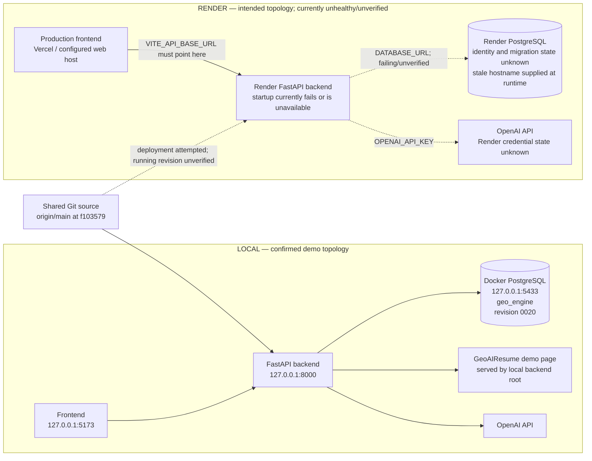

# Local vs Render Environment Audit

**Audit date:** 2026-09-24 EDT  
**Scope:** Read-only inspection of repository configuration, local processes, local PostgreSQL instances, the preserved database dump, Git history, and the public Render endpoint. No application code, environment variables, migrations, database records, Docker state, or Render settings were changed.

## Executive conclusion

The successful professor demo was a **local-only run**. Its browser used the frontend at `127.0.0.1:5173`, its FastAPI process listened at `127.0.0.1:8000`, and that process had established database connections to the Docker PostgreSQL published on `127.0.0.1:5433`. That database is named `geo_engine`, is at Alembic revision `20260923_0020`, and contains two Teacher dataset versions, 10 training samples, and latest version `teacher-dataset-v000002`.

This does **not** establish any equivalent state on Render. The Render endpoint did not return a response during this audit (both `/health` and `/` timed out after 15 seconds), and the repository has no `render.yaml` from which production environment bindings can be inspected. Migration `0020`, dataset `v000002`, and the demo exports are therefore not confirmed in production.

The failed deployment hostname `dpg-da1ngbbutv3s73ffaeug-a` occurs zero times in tracked source and zero times in the inspected workspace. The Docker startup command runs `alembic upgrade head`, and Alembic takes its URL from the runtime `DATABASE_URL`. The hostname therefore comes from the `DATABASE_URL` supplied to the Render service at runtime. Repository evidence cannot determine whether that Render value is a manually entered variable or a managed-database connection binding; that final distinction requires inspecting the Render service's Environment page.

## 1. Database configuration

### Local

There are two local environment files and two distinct local PostgreSQL endpoints:

| Source | Tracked | `DATABASE_URL` endpoint (credentials omitted) | Role |
|---|---:|---|---|
| `backend/.env` | No; ignored by `.gitignore` | `postgresql://…@127.0.0.1:5433/geo_engine` | Effective configuration of the currently running demo backend |
| `backend/.env.local` | No; ignored by `.gitignore` | `postgresql://…@127.0.0.1:5432/geo_engine` | Loaded explicitly by `start_local.sh` |
| `backend/.env.local.example` | Yes | `postgresql://…@127.0.0.1:5432/geo_engine` | Committed local-development template |
| Repository-root `.env` | — | Absent | No effect |

The current FastAPI process was started directly as `python -m uvicorn main:app --host 127.0.0.1 --port 8000`, from the backend directory. Its live TCP connections go to `127.0.0.1:5433`, which matches `backend/.env`. Port 5433 is published by the local `geo-postgres` Docker container from container port 5432. This is local Docker PostgreSQL, not Render PostgreSQL.

The second endpoint, `127.0.0.1:5432`, is a separate Homebrew PostgreSQL server. A read-only comparison found:

| Local endpoint | Server | Alembic revision | Dataset versions | Samples | Latest dataset |
|---|---|---|---:|---:|---|
| `127.0.0.1:5433/geo_engine` | Docker `postgres:16` (`geo-postgres`) | `20260923_0020` | 2 | 10 | `teacher-dataset-v000002` |
| `127.0.0.1:5432/geo_engine` | Homebrew PostgreSQL 16 | `20260923_0019` | 0 | 0 | none |

This is local database-host drift in addition to the Render issue: `backend/.env` and `backend/.env.local` do not identify the same local server. `start_local.sh` exports `.env.local` before launching the application, so a fresh run through that script would use port 5432. A direct backend launch from `backend/`, such as the successful demo process, loads `backend/.env` and uses port 5433.

### How the application resolves the URL

- `backend/app/core/config.py` calls `load_dotenv()` and defines `Settings.DATABASE_URL`, with Pydantic's `env_file = ".env"`.
- `backend/app/core/database.py` calls `load_dotenv()` and reads `os.getenv("DATABASE_URL")` to create the SQLAlchemy engine.
- Existing process environment variables take precedence over dotenv values because no `override=True` is used.
- The relative `.env` depends on the process working directory. The normal backend and Docker working directory is `backend/` or `/app`, respectively.
- `start_local.sh` explicitly exports `backend/.env.local`; those exported values take precedence when Python later calls `load_dotenv()`.

### Render

Render is expected to obtain `DATABASE_URL` from the Render service environment. `DEPLOYMENT.md` explicitly lists `DATABASE_URL` among the variables to configure in Render. There is no tracked production value and no tracked hardcoded Render database URL.

No `render.yaml` or `render.yml` exists in the repository. Consequently:

- the repository neither creates nor links a Render PostgreSQL service;
- the repository cannot show which Render database is bound;
- the environment value must be managed outside Git, in Render's service configuration.

`backend/Dockerfile` does not define a database. It copies the backend, installs requirements, and starts with:

```text
alembic upgrade head && uvicorn main:app --host 0.0.0.0 --port 8000
```

`docker-compose.yml` defines only the local `geo-postgres` service, database `geo_engine`, and host mapping `5433:5432`. It does not define the backend service and is not a Render database declaration.

### Does Alembic use the application's database URL?

Yes. `backend/alembic/env.py` imports the same `settings` object used by the application configuration and assigns `settings.DATABASE_URL` to `sqlalchemy.url`; both online and offline migration paths use that value. `alembic.ini` deliberately leaves `sqlalchemy.url` blank. Under one runtime environment, application and Alembic therefore resolve the same `DATABASE_URL`.

The Render failure occurs before Uvicorn because the Docker command runs Alembic first. A stale or unreachable Render `DATABASE_URL` prevents deployment startup.

### Origin of `dpg-da1ngbbutv3s73ffaeug-a`

Repository-wide searches found **no occurrence** of `dpg-da1ngbbutv3s73ffaeug-a`:

- zero occurrences in tracked Git source;
- zero occurrences in ignored local environment files;
- zero occurrences in other inspected workspace text;
- no `render.yaml` capable of supplying it.

It is therefore being supplied by the Render runtime environment, via `DATABASE_URL`. The most likely Render-level sources are a manually configured environment variable or a database-linked environment value. Which of those two is the exact dashboard source is **unknown from repository evidence** and must be verified in Render itself. No replacement hostname or URL should be inferred from the old value.

## 2. Provenance of recent demo work

The classification describes where the action/result was actually observed, not whether related code is committed.

| Recent claim | Classification | Evidence and qualification |
|---|---|---|
| Migration upgraded through `20260923_0020` | **LOCAL ONLY** | Confirmed on local Docker PostgreSQL at port 5433. The migration file itself is shared source, but application to Render is unconfirmed. |
| Backend restarted | **LOCAL ONLY** | Current process is a macOS Python/Uvicorn process bound to `127.0.0.1:8000`, started 2026-09-23 15:40 EDT. No Render restart was performed or evidenced. |
| OpenAI key updated | **LOCAL ONLY** | It is configured in ignored local environment files. No tracked secret and no evidence of a Render variable update. |
| Audit tests | **LOCAL ONLY** | Test execution and live Audit verification used the local backend. Test/source changes, where committed, are shared source; execution was not Render. |
| Predictor tests | **LOCAL ONLY** | Executed against the local frontend/backend. No production execution evidence. |
| Teacher Pipeline tests | **LOCAL ONLY** | Executed against the local backend and local Docker PostgreSQL. |
| End-to-end Professor Demo | **LOCAL ONLY** | The recorded review explicitly names `http://127.0.0.1:8000`; live process connections prove its database was local port 5433. |
| GeoAIResume at `http://127.0.0.1:8000/` | **LOCAL ONLY** | A loopback URL is accessible only from the same machine. The route and demo HTML are committed shared source, but the demonstrated endpoint was local. |
| Frozen reference set | **SHARED SOURCE CODE** | The immutable pack and hashes are committed in `backend/app/experiment/demo_reference_pack.py` and its source dataset is in the repository. Experiments that used it and their persisted snapshots are local-only database records. |
| `teacher-dataset-v000002` | **LOCAL ONLY** | Found in local Docker PostgreSQL at port 5433; absent from local port 5432; not verifiable on Render. |
| JSONL / CSV exports | **LOCAL ONLY** | Export HTTP 200 results were obtained from the loopback backend and reflect its local dataset. Export route implementation is shared source. |
| Database backup | **LOCAL ONLY** | `tmp/live-api-pre-0019-20260923T131157.dump` is an untracked local PostgreSQL custom dump. Its archive metadata names `geo_engine`, was created on 2026-09-23, and says it was dumped from PostgreSQL 16.14 (Homebrew). It is not evidence of a Render backup. |

The source commit containing migration `0020` and the controlled-validation changes is `f103579`, and local `main` equals `origin/main`. This proves the code is in the shared Git repository. It does not prove a successful Render build, migration, or running revision.

## 3. Environment and deployment files

| File/module | Local effect | Render effect |
|---|---|---|
| `backend/.env` | Ignored local config; currently points direct launches to local Docker PostgreSQL port 5433 and supplies the local OpenAI key. | None unless someone separately copies it into an image or environment; it is not tracked and is not in a clean Git checkout. |
| `backend/.env.local` | Ignored local config loaded explicitly by `start_local.sh`; currently points to local Homebrew PostgreSQL port 5432. | None. |
| `backend/.env.local.example` | Template for local startup, tracked. | No automatic effect. |
| `backend/app/core/config.py` | Loads process environment/`.env` and validates required variables. | Reads Render-injected process environment; environment variables override `.env`. |
| `backend/app/core/database.py` | Builds the application engine from process `DATABASE_URL`. | Same behavior. |
| `backend/alembic.ini` | Migration metadata; URL blank. | Same. |
| `backend/alembic/env.py` | Replaces blank URL with `settings.DATABASE_URL`. | Same runtime URL as the application. |
| `backend/Dockerfile` | Can run a container locally; does not define database settings. | Expected deployment entry point; migrates the injected database before starting the API. |
| `docker-compose.yml` | Creates local `postgres:16` and publishes it at host port 5433. | No Render database binding. |
| `scripts/setup_local_db.sh` | Defaults to local port 5432 and creates/owns the local database when used. | Must not be used for Render. |
| `start_local.sh` | Sources `.env.local`, applies migrations, and starts loopback backend/frontend. | Local-only script; not the Docker/Render command. |
| `DEPLOYMENT.md` | Documentation only. | Instructs operators to set `DATABASE_URL`, `OPENAI_API_KEY`, and `BACKEND_URL` in Render. |
| `render.yaml` | Absent. | No infrastructure-as-code definition or database reference exists. |
| Other startup/deployment scripts | No additional tracked Render startup script was found. | Docker `CMD` is the only tracked production startup contract. |

No local secrets are tracked. Both actual backend environment files are excluded by `.gitignore`. This audit did not copy or print their credentials.

## 4. Local-only assumptions present in shared source

No local database URL was inserted into Render configuration because there is no tracked Render configuration. However, recent shared application code contains local-demo assumptions that would execute if the same commit successfully starts on Render:

1. `backend/app/services/property_service.py` defines the default GeoAIResume property as `http://127.0.0.1:8000` and converts listed legacy production domains to that loopback URL when seeding. Startup calls `seed_default_property`. On Render, `127.0.0.1:8000` means the Render container itself, not the professor's local demo site.
2. `backend/main.py` serves the GeoAIResume demo article at the backend root in every environment; it is not gated to local development.
3. `backend/app/experiment/demo_reference_pack.py` activates the frozen demo pack only for the loopback GeoAIResume property. That condition is committed shared behavior.
4. Several frontend API clients fall back to `http://127.0.0.1:8000` when `VITE_API_BASE_URL` is absent. A production frontend build must explicitly set `VITE_API_BASE_URL` to the Render API or it will call each viewer's own machine.

These are shared source-code assumptions, not proof that Render configuration was changed. They are nevertheless production risks once that source is deployed. Per the audit request, they were not altered.

## 5. Actual runtime topology



Shared components are the Git source and the external OpenAI service. Local and Render backend processes, environment variables, databases, migration histories, and data records are independent. GeoAIResume in the successful demo was embedded in the local backend; it was not an independently deployed Render component.

## 6. Explicit answers

### 1. Did the successful professor demo run against Render or against the local backend?

**Against the local backend.** The documented URL was `http://127.0.0.1:8000`, and the still-running process is a local macOS Uvicorn process bound to that address.

### 2. Did it use the Render production PostgreSQL database or another database?

**Another database: local Docker PostgreSQL.** The backend's established connections go to `127.0.0.1:5433`, the published port of container `geo-postgres`.

### 3. Is migration `20260923_0020` confirmed applied to Render production PostgreSQL, or only locally?

**Only locally.** It is confirmed on local port 5433. Render did not become healthy, and no production database query or successful migration log was available.

### 4. Is `teacher-dataset-v000002` in Render production DB or only the demo/local DB?

**Confirmed only in the demo/local database.** It is present on local port 5433 with 10 samples. Its presence on Render is unknown and must not be claimed.

### 5. Where exactly does the stale host `dpg-da1ngbbutv3s73ffaeug-a` come from?

It comes from the **Render backend's runtime `DATABASE_URL`**, not repository code. The repository cannot reveal whether Render populated it through a manual environment value or a managed-database binding. The exact dashboard entry must be inspected in Render; no replacement should be guessed.

### 6. Were any local-only assumptions accidentally introduced into production configuration?

**Not into a tracked Render configuration—none exists.** However, **yes, local-only assumptions were introduced into shared source**: loopback GeoAIResume property seeding, an always-enabled demo root page, a loopback-gated reference pack, and frontend loopback API fallbacks. Those would affect production if the shared commit runs there. The local `.env` files themselves remain ignored and were not copied to Render by Git.

### 7. What needs to be changed in Render configuration to restore deployment?

Without changing repository code, Render configuration needs the following operator actions:

1. In the Render backend service, inspect the `DATABASE_URL` environment entry and determine whether it is manual or linked to a managed PostgreSQL resource.
2. Replace/relink that stale entry with the **actual active Render PostgreSQL connection value supplied by the intended database resource**. Do not construct or guess a URL from the stale hostname.
3. Verify the intended Render PostgreSQL instance exists, is running, and permits the backend service to connect over the appropriate Render network endpoint.
4. Confirm the backend service root/build context selects `backend/Dockerfile`, and that required Render variables such as `OPENAI_API_KEY` are separately configured in Render. Do not copy local `.env` files.
5. Redeploy commit `f103579` (or the explicitly selected production revision). The Docker startup should then run `alembic upgrade head` against the corrected production URL before starting Uvicorn.
6. Verify from Render logs that Alembic reaches `20260923_0020`, then verify `/health` returns HTTP 200. Only after that should production database rows, Teacher dataset state, and exports be checked.
7. Ensure the production frontend build defines `VITE_API_BASE_URL=https://geo-engine.onrender.com` (or the actual backend service URL), so it does not use the loopback fallback.

This audit does not recommend copying the local port-5433 database URL, local OpenAI key, local dataset records, or local backup into Render. Whether the local-demo source assumptions should be gated or reverted is a separate code decision and was intentionally not performed here.

## Evidence limitations

- There is no Render connector, dashboard export, or `render.yaml` in the available workspace.
- The public Render endpoint timed out with no HTTP response during this audit.
- No direct production PostgreSQL connection was made.
- Therefore the exact Render environment-variable binding, production database identity, running Git revision, migration version, and production dataset contents remain unverified.

These unknowns are deliberately reported as unknown rather than inferred from the successful local demo.
