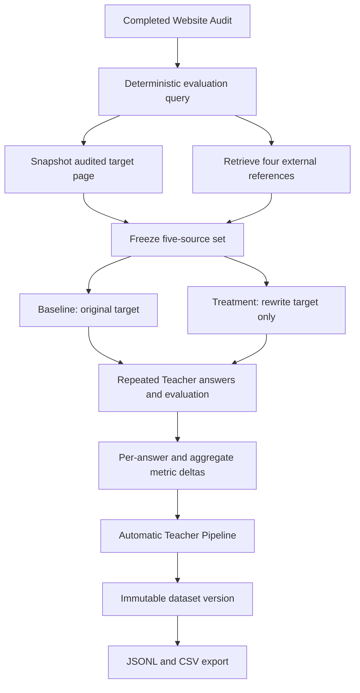

# Princeton-Style New-Website Teacher Validation

## Purpose and scope

This workflow validates a GEO rewrite for an audited website through a controlled source intervention. It is a **Princeton-style new-website validation extension**. It is not GEO-Bench replication.

The implementation does not add model training, Predictor inference, Qwen, Llama, or LoRA. It connects the existing Audit, GEO experiment, evaluation, Teacher Pipeline, dataset, and export components.

## Controlled workflow

## Evaluation query policy

The demo uses `audit-evidence-query-v1`, a deliberately small deterministic policy:

1. Select the audit recommendation chosen in the existing Predictor UI.
2. Select the audited target page: the recommendation's successful evidence URL when available, otherwise the successful audited homepage, otherwise the first successful audited URL.
3. Snapshot that page again at validation time and extract its title, H1, and cleaned body text.
4. Select the topic in order: page H1, page title, audit product summary, recommendation title.
5. Generate: `What should someone know about {topic} from {brand}?`

The generated query, policy version, exact audit ID, recommendation evidence, page evidence, and brand input are frozen before any baseline or treatment generation.

## Source-set construction

The source set always has exactly five ordered documents:

| Rank | Role | Rule |
|---:|---|---|
| 1 | `audited_target` | Exact audited page snapshot; always marked as the optimization target |
| 2–5 | `reference` | Four distinct external sources returned by the configured retrieval abstraction |

Reference results from the audited website's host are excluded. Duplicate URLs and empty documents are excluded. Retrieval never replaces source 1 and never chooses the target randomly.

Teacher Validation requires the Google Custom Search API configuration currently used by the retrieval abstraction. Both `GOOGLE_SEARCH_API_KEY` and `GOOGLE_SEARCH_ENGINE_ID` must be configured. This workflow explicitly disables the Google HTML parser fallback; missing credentials produce HTTP 503 with a configuration explanation.

## Frozen provenance

The experiment persists:

- Evaluation query and `audit-evidence-query-v1` policy version.
- Source audit and recommendation evidence.
- Target URL and full cleaned target snapshot.
- Four reference URLs and full cleaned snapshots.
- Stable ranks and target rank 1.
- Source roles.
- Retrieval provider and UTC timestamp.
- SHA-256 content hashes.
- Provider, Teacher model, prompt version, temperature, seed, and generation parameters.

The Teacher sample provenance includes the full ordered source set, content snapshots and hashes, audited target identity, per-run provenance, and aggregate metrics.

## Baseline and treatment controls

Baseline uses the original audited target snapshot at source rank 1. Treatment applies the selected existing GEO strategy only to that target text. The prompt builder leaves ranks 2–5 unchanged.

Both arms use the same:

- frozen query;
- five-source membership and order;
- four reference snapshots;
- target rank;
- answer-generation provider/model and parameters;
- prompt template;
- repeated-answer count;
- evaluation implementation and metric versions.

The existing engine generates five answers per strategy. Every answer is persisted and evaluated against the audited target's URL, title, rank, and baseline/treatment text.

## Metrics and training labels

Per-answer metrics remain stored on each experiment run. They include PAWC, citation count, position, word measures, visibility score, response length, latency, and any configured subjective metrics.

For each optimized answer, Teacher Pipeline pairs the baseline answer with the same sample index. It stores original metrics, optimized metrics, and `optimized - original` deltas.

The sample also records mean baseline, mean treatment, and mean delta across repeated answers. The primary signal is:

`aggregate_delta_visibility_score = mean(treatment target visibility) - mean(baseline target visibility)`

PAWC, citation, position, word, and available subjective deltas remain secondary metrics. This is an observed treatment effect under the frozen Teacher configuration, not universal ground truth.

## Teacher Pipeline validity gate

For `new_website_teacher_validation` experiments, sample construction rejects the result unless:

- source rank 1 is selected;
- source rank 1 has role `audited_target`;
- exactly five sources exist;
- exactly four sources have role `reference`;
- baseline and treatment share query, sample index, provider, model, and completed evaluation records.

The exact source audit ID is used rather than selecting an arbitrary latest audit. After the experiment commits successfully, the existing completion hook automatically runs Teacher Pipeline and creates a new immutable cumulative dataset version.

## Web-interface flow

The professor uses only the existing UI:

1. Add/select a public website.
2. Run Website Audit.
3. Click **Continue to Optimization**.
4. Review the passed audit context and click **Validate**.
5. The backend freezes the query, audited target, and four references, then runs baseline and treatment in the background.
6. The Predictor page polls Running/Completed/Failed state.
7. On completion, the UI opens Teacher Pipeline.
8. Teacher Pipeline shows the new sample count and dataset version.
9. Download JSONL or CSV.

Experiment Lab and command-line interaction are not required.

## Current local-runtime prerequisite

As of the 2026-09-23 verification, the local backend does not have `GOOGLE_SEARCH_API_KEY` or `GOOGLE_SEARCH_ENGINE_ID`. The live workflow therefore stops before experiment creation with a deliberate HTTP 503 configuration error. This protects scientific integrity by preventing HTML-scraped or fabricated references. Configure both values and restart the backend before the final live demo rerun.
