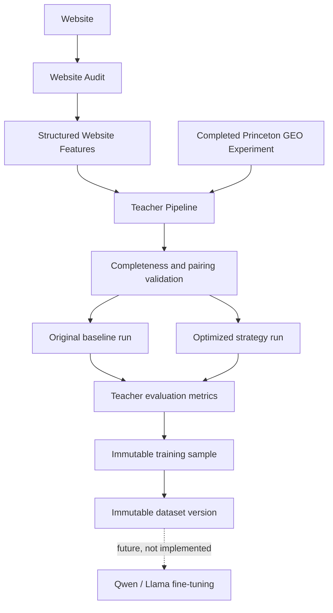

# Teacher Pipeline Design

## Purpose

The Teacher Pipeline is the reproducible data bridge between completed Princeton GEO experiments and future student-model training. It does not train, fine-tune, serve, or evaluate Qwen, Llama, or any other student model.

Its only job is to turn valid experimental evidence into immutable supervised samples and immutable dataset-version manifests.



## Why Princeton acts as the Teacher

The Princeton GEO methodology provides a controlled procedure for testing content interventions: retrieve/select source material, apply a named GEO strategy, generate responses under recorded model settings, and calculate objective evaluation metrics. In this platform, that methodology is treated as a **teacher protocol**, not as a static final dataset.

The teacher is the complete experimental process:

- a frozen query/source/seed context;
- an `original` baseline run;
- an optimized strategy run under the same context;
- exact provider, model, prompt, generation parameters, and evaluator versions;
- original and optimized measurements;
- explicit metric deltas.

The dataset therefore grows from experiments actually executed by the platform. No paper table is copied and presented as new training data.

## Sample generation

The independent `teacher_pipeline_agent.py` polls for completed experiments. This avoids modifying Experiment Lab execution or the Princeton methodology.

For every unprocessed optimized run, the pipeline:

1. verifies that the experiment is completed and has a completion timestamp;
2. finds the most recent completed website audit that existed when the experiment completed;
3. matches the optimized run to an `original` run with the same experiment query and sample index;
4. requires matching provider/model context, prompt version, completed evaluations, metrics, response, and selected source document;
5. snapshots the structured audit profile and website feature vector;
6. snapshots original and optimized metric maps;
7. computes `optimized - original` for every shared numeric metric without estimating missing values;
8. records canonical provenance, including hashes of source text, prompts, responses, model context, evaluator versions, seed, and experiment settings;
9. writes one immutable sample for the validated baseline/treatment pair;
10. creates a new immutable cumulative dataset manifest containing every sample available at that version.

An experiment with multiple queries, strategies, seeds, or samples can create multiple supervised rows. Each row remains a single matched experimental comparison. This preserves scientific granularity and avoids selecting only a winning strategy.

Incomplete pairs are skipped, not partially materialized. The worker can reconsider them on a later pass after missing audit/evaluation evidence exists.

## Training sample schema

`teacher_training_samples` contains:

- `sample_id`: stable UUID;
- `website_id`, `experiment_id`, `experiment_run_id`, `baseline_run_id`, `experiment_query_id`, and `audit_id` lineage;
- `audit_version` and the complete JSON feature vector;
- optimization strategy;
- teacher provider, model, and recorded model version identifier;
- prompt, evaluation, and metric schema versions;
- original, optimized, and delta metric JSON maps;
- canonical provenance JSON and SHA-256 hash;
- introduction `dataset_version` and creation timestamp.

Rows reject updates and deletion at the SQLAlchemy layer. Foreign-key deletion is restricted for scientific source records. The provenance hash also prevents duplicate evidence from silently appearing under different sample IDs.

## Dataset versioning

Every successful append produces an immutable cumulative dataset snapshot:

- `dataset_version` (`teacher-dataset-v000001`, etc.);
- exact creation time;
- teacher model identifiers represented in the snapshot;
- metric schema versions represented in the snapshot;
- distinct experiment count;
- total sample count;
- ordered sample membership;
- canonical manifest and manifest SHA-256 hash.

The JSONL export starts with a dataset metadata record and then emits the immutable training sample records. This makes the version, teacher model, metric version, experiment count, and manifest hash travel with every export.

## Continuous dataset growth

The worker queries completed experiments without changing their execution. A uniqueness constraint on `experiment_run_id` makes processing idempotent. When new valid experiment pairs appear, the worker appends new immutable samples and writes a new cumulative dataset version. Prior samples and manifests remain unchanged.

This approach supports future scientific publications because a result can cite a precise dataset version and reconstruct its membership and upstream evidence.

## Future Qwen/Llama consumption

Future training code can consume a frozen JSONL export or query one dataset version's membership. It will receive structured website features, strategy labels, teacher context, paired outcomes, deltas, and provenance.

Before any student-model work begins, a separate design must define leakage-safe train/validation/test splits, target selection, model licensing, calibration, evaluation gates, and artifact/model registries. None of those capabilities are implemented by this foundation.

## APIs and transparency UI

- `GET /api/v1/teacher-pipeline/status`: pipeline/sample/dataset summary and recent samples.
- `GET /api/v1/teacher-pipeline/samples`: read-only sample list.
- `GET /api/v1/teacher-pipeline/dataset/export`: latest cumulative dataset as JSONL with metadata.
- `/teacher-pipeline`: read-only frontend page showing status, counts, teacher models, current dataset version, last processed experiment, pending experiments, and recent provenance hashes.

There is intentionally no public mutation, training, inference, or prediction endpoint. Dataset creation is owned by the independent worker.

## Operating the worker

After applying the migration, run from `backend/`:

```bash
python -u teacher_pipeline_agent.py
```

The worker polls every 30 seconds. It can also be invoked once in operational tooling through `teacher_pipeline_agent.run_once()`.

## Migration summary

Migration `20260923_0019_teacher_pipeline.py` adds:

1. `teacher_training_samples` for immutable paired samples and full provenance;
2. `teacher_dataset_versions` for immutable dataset metadata/manifests;
3. `teacher_dataset_members` for ordered, version-specific membership.

It adds indexes for source lineage, strategy, teacher model, dataset version, and provenance hashes. It does not alter existing Audit, Experiment, Predictor, replication, or legacy `training_samples` tables. The downgrade removes only the three Teacher Pipeline tables.

## Non-goals

- No Qwen or Llama integration.
- No LoRA or other fine-tuning.
- No embeddings or feature learning.
- No model training, inference, prediction, or registry.
- No changes to Website Audit behavior.
- No changes to Princeton experiment execution, prompts, retrieval, strategies, or evaluation methodology.
