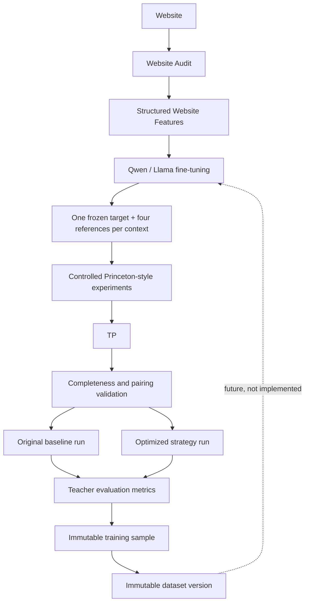

# Teacher Pipeline Design

## Purpose

The Teacher Pipeline is the reproducible data bridge between completed Princeton GEO experiments and future student-model training. It does not train, fine-tune, serve, or evaluate Qwen, Llama, or any other student model. A training sample now means one distinct query/source-set/strategy context with one matched baseline-versus-treatment pair; it does not mean another stochastic answer to an already-counted context.

Its only job is to turn valid experimental evidence into immutable supervised samples and immutable dataset-version manifests.


```mermaid
flowchart TD
    W[Website] --> A[Website Audit]
    A --> F[Structured Website Features]
    F --> Q[Deterministic evidence-derived query contexts]
    Q --> R[One frozen target + four references per context]
    R --> E[Controlled Princeton-style experiments]
    E --> TP
    TP --> V[Completeness and pairing validation]
    V --> B[Original baseline run]
    V --> O[Optimized strategy run]
    B --> M[Teacher evaluation metrics]
    O --> M
    M --> S[Immutable training sample]
    S --> D[Immutable dataset version]
    D -. future, not implemented .-> Q[Qwen / Llama fine-tuning]
```

## Why Princeton acts as the Teacher

The Princeton GEO methodology provides a controlled procedure for testing content interventions: retrieve/select source material, apply a named GEO strategy, generate responses under recorded model settings, and calculate objective evaluation metrics. In this platform, that methodology is treated as a **teacher protocol**, not as a static final dataset.

The teacher is the complete experimental process:

- a frozen query/source/seed context;
- an `original` baseline run;
- an optimized strategy run under the same context;
- exact provider, model, prompt, generation parameters, and evaluator versions;
- original and optimized measurements;
- explicit metric deltas.

The dataset therefore grows from experiments actually executed by the platform. No paper table is copied and presented as new training data.

## Sample generation

The independent `teacher_pipeline_agent.py` polls for completed experiments. This avoids modifying Experiment Lab execution or the Princeton methodology.

The explicit training-data workflow first prepares deterministic queries from the analyzed audit pages. It records the audit page, title/H1/metadata evidence, path family, intent classification, query source, and query-policy version. It rejects duplicate and near-duplicate normalized queries. It then freezes the audited target plus four external reference snapshots once for each query; baseline and treatment use the same ordering and hashes, and only the selected target content is rewritten.

For every unprocessed optimized run, the pipeline:

1. verifies that the experiment is completed and has a completion timestamp;
2. finds the most recent completed website audit that existed when the experiment completed;
3. matches the optimized run to an `original` run with the same experiment query and sample index;
4. requires matching provider/model context, prompt version, completed evaluations, metrics, response, and selected source document;
5. snapshots the structured audit profile and website feature vector;
6. snapshots original and optimized metric maps;
7. computes `optimized - original` for every shared numeric metric without estimating missing values;
8. records canonical provenance, including hashes of source text, prompts, responses, model context, evaluator versions, seed, and experiment settings;
9. calculates a deterministic context fingerprint from normalized query, ordered target/reference snapshot hashes, target position, and strategy;
10. writes one immutable sample for the validated baseline/treatment pair, while preventing the new training workflow from counting a duplicate context again;
11. creates a new immutable cumulative dataset manifest containing every training-eligible sample available at that version.

`training_sample_count` and `repetitions_per_context` are independent. The professor default is 100 distinct contexts × 1 repetition = 100 paired samples. Historical experiments that used 1 query × 5 stochastic repetitions remain readable as five experimental records, but they are not mislabeled as five different questions. Frozen professor-demo records are preserved and shown as demo/research evidence, but are marked `source_mode=frozen_demo`, `training_eligible=false`, and excluded from training exports.

Incomplete pairs are skipped, not partially materialized. The worker can reconsider them on a later pass after missing audit/evaluation evidence exists.

## Training sample schema

`teacher_training_samples` contains:

- `sample_id`: stable UUID;
- `website_id`, `experiment_id`, `experiment_run_id`, `baseline_run_id`, `experiment_query_id`, and `audit_id` lineage;
- `audit_version` and the complete JSON feature vector;
- optimization strategy;
- teacher provider, model, and recorded model version identifier;
- prompt, evaluation, and metric schema versions;
- original, optimized, and delta metric JSON maps;
- query text, source (`generated`, `benchmark`, or `live_retrieval` where applicable), supported intent, and originating audit page;
- original target, optimized target, baseline answer, treatment answer, and ordered source-snapshot lineage;
- context fingerprint, source mode, and explicit training eligibility;
- canonical provenance JSON and SHA-256 hash;
- introduction `dataset_version` and creation timestamp.

Rows reject updates and deletion at the SQLAlchemy layer. Foreign-key deletion is restricted for scientific source records. The provenance hash also prevents duplicate evidence from silently appearing under different sample IDs.

## Dataset versioning

Every successful append produces an immutable cumulative dataset snapshot containing only training-eligible samples:

- `dataset_version` (`teacher-dataset-v000001`, etc.);
- exact creation time;
- teacher model identifiers represented in the snapshot;
- metric schema versions represented in the snapshot;
- distinct experiment count;
- total sample count;
- ordered sample membership;
- canonical manifest and manifest SHA-256 hash.

The JSONL export starts with a dataset metadata record and then emits the immutable training sample records; CSV emits the same sample fields in tabular form. Both exports retain the context fingerprint, query/source/intent, target and reference URLs/hashes/order, strategy, answers, metric maps, model, source mode, eligibility, experiment/audit lineage, provenance hash, and timestamps. Metric aliases (`baseline_metrics`, `treatment_metrics`, and `metric_deltas`) are included alongside the existing original/optimized/delta names for future training consumers.

## Continuous dataset growth

The worker queries completed experiments without changing their execution. A uniqueness constraint on `experiment_run_id` makes processing idempotent. When new valid experiment pairs appear, the worker appends new immutable samples and writes a new cumulative dataset version. Prior samples and manifests remain unchanged.

This approach supports future scientific publications because a result can cite a precise dataset version and reconstruct its membership and upstream evidence.

## Future Qwen/Llama consumption

Future training code can consume a frozen JSONL export or query one dataset version's membership. It will receive structured website features, strategy labels, teacher context, paired outcomes, deltas, and provenance.

Before any student-model work begins, a separate design must define leakage-safe train/validation/test splits, target selection, model licensing, calibration, evaluation gates, and artifact/model registries. None of those capabilities are implemented by this foundation.

## APIs and transparency UI

- `GET /api/v1/teacher-pipeline/status`: pipeline/sample/dataset summary, distinct-context diversity counts, generation progress, and recent samples.
- `GET /api/v1/teacher-pipeline/samples`: read-only sample list.
- `GET /api/v1/teacher-pipeline/dataset/export`: latest cumulative dataset as JSONL with metadata.
- `POST /api/v1/teacher-pipeline/dataset-generation/preview`: validates that the selected audit supports the requested distinct contexts and returns the expected baseline, treatment, and evaluation call counts without starting paid generation.
- `POST /api/v1/teacher-pipeline/dataset-generation/start`: requires explicit confirmation, freezes source sets, and starts the requested job.
- `/teacher-pipeline`: shows unique-query/page/intent/source-set counts, context preparation and experiment progress, the selected strategy and repetitions separately, and expandable sample provenance including answers and source snapshots.

There is no model-training, inference, or prediction endpoint. The only mutation added here is the explicitly confirmed Teacher dataset-generation job; preparing its preview never calls the Teacher model.

## Operating the worker

After applying the migration, run from `backend/`:

```bash
python -u teacher_pipeline_agent.py
```

The worker polls every 30 seconds. It can also be invoked once in operational tooling through `teacher_pipeline_agent.run_once()`.

## Migration summary

Migration `20260923_0019_teacher_pipeline.py` adds:

1. `teacher_training_samples` for immutable paired samples and full provenance;
2. `teacher_dataset_versions` for immutable dataset metadata/manifests;
3. `teacher_dataset_members` for ordered, version-specific membership.

It adds indexes for source lineage, strategy, teacher model, dataset version, and provenance hashes. It does not alter existing Audit, Experiment, Predictor, replication, or legacy `training_samples` tables. The downgrade removes only the three Teacher Pipeline tables.

## Non-goals

- No Qwen or Llama integration.
- No LoRA or other fine-tuning.
- No embeddings or feature learning.
- No model training, inference, prediction, or registry.
- No changes to Website Audit behavior.
- No changes to Princeton experiment execution, prompts, retrieval, strategies, or evaluation methodology.
