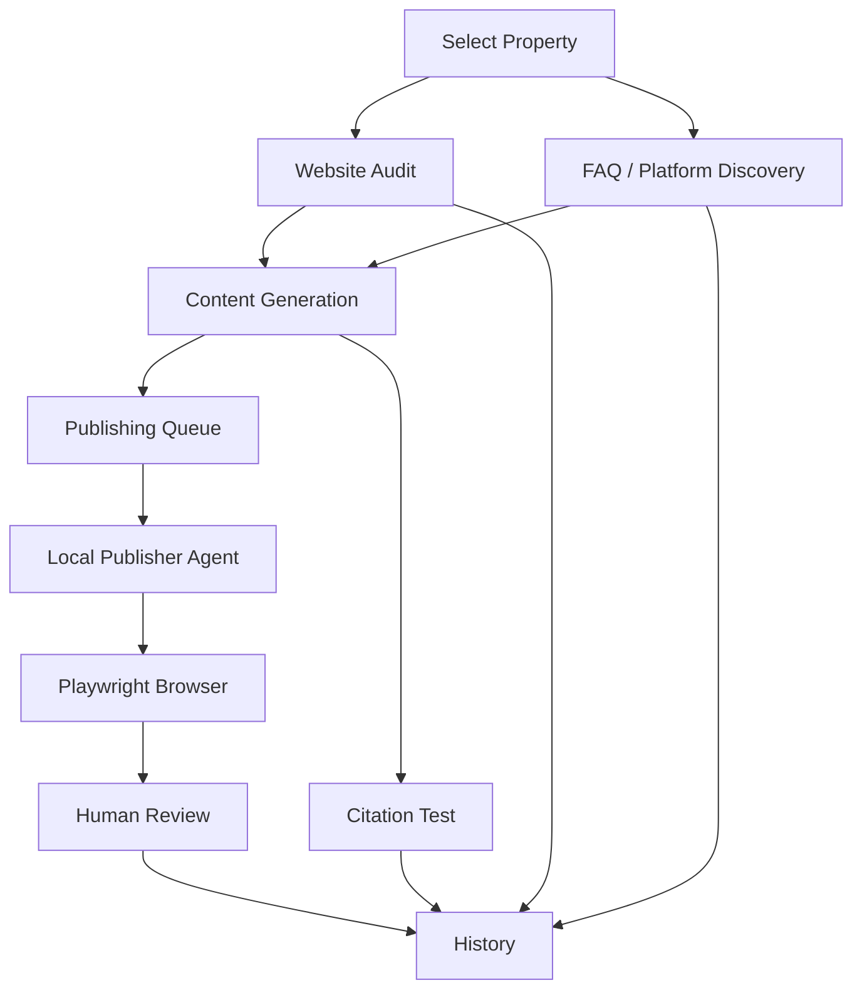
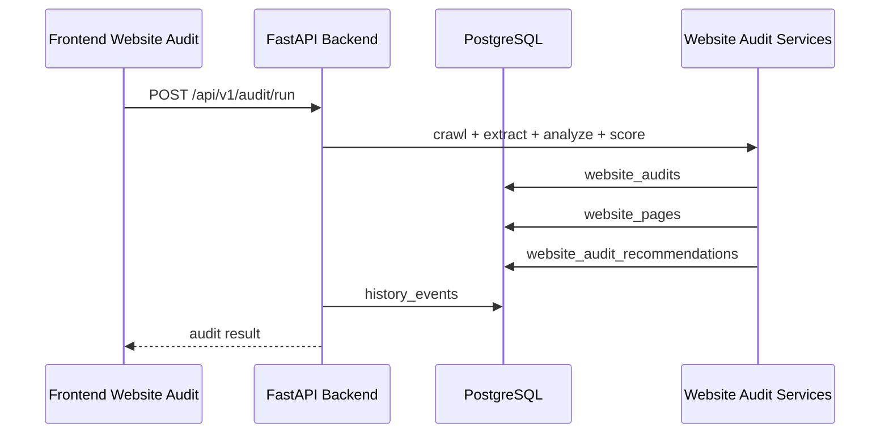
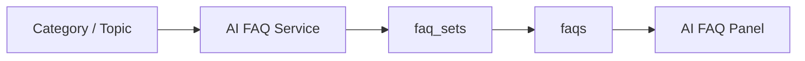
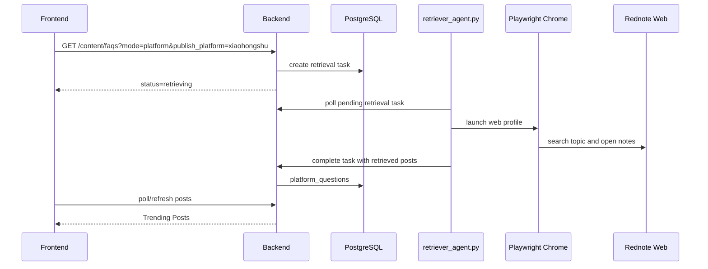
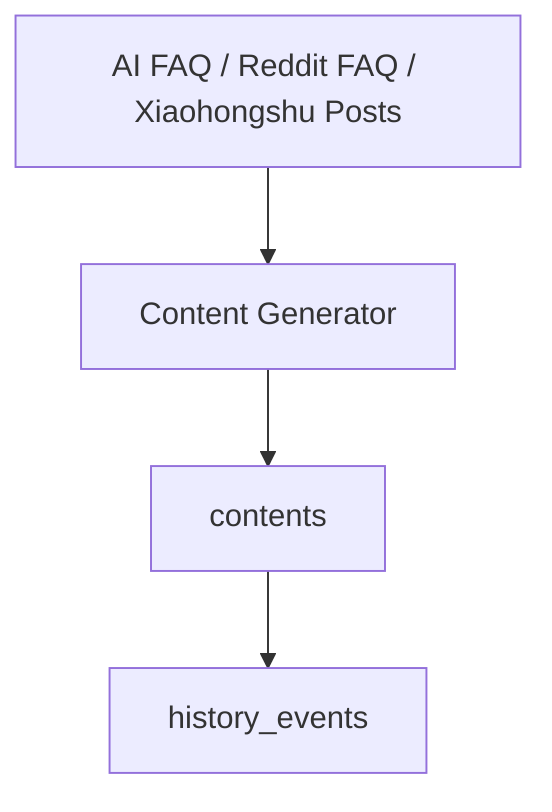
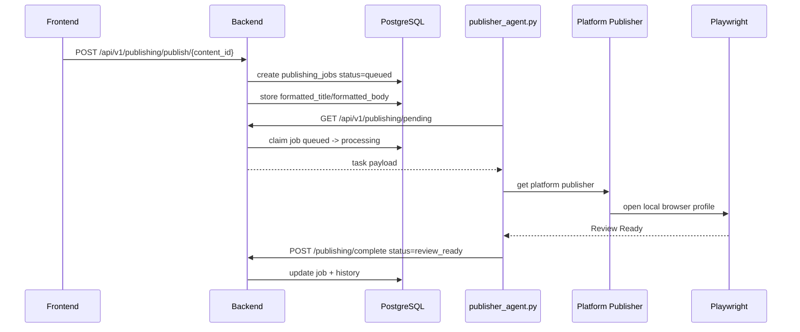
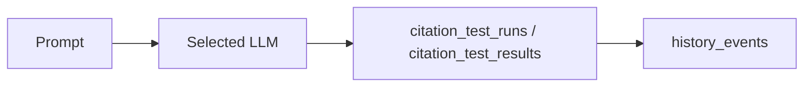

# Workflow

This document describes the complete GEO Engine runtime workflow from research setup to history tracking.

## High-Level Flow



## Property Context

Every workflow starts with a selected Property. The Property provides:

- name;
- brand name;
- domain;
- description;
- `property_id` for database scoping.

All pages should operate only on the active Property.

## Website Audit



The audit stores pages, score components, brand understanding, missing pages, missing topics, internal link suggestions, FAQ opportunities, and content recommendations.

## FAQ and Platform Discovery

### AI FAQ



AI FAQ is generated by the LLM and stored in `faq_sets` and `faqs`.

### Reddit Platform FAQ


Reddit naturally provides question/discussion style data, so the UI displays platform FAQs.

### Xiaohongshu Trending Posts



Xiaohongshu does not convert retrieved posts into FAQ for the current product behavior. It displays platform posts directly and uses them as grounding for Xiaohongshu-native content.

## Content Generation



Generated content is stored in `contents`. Publishing must not overwrite generated content. Platform-specific formatting is stored on publishing jobs.

## Publishing Queue



The queue is consumed by a local publisher agent, not by Render.

## Human Review Mode

Publishing prepares the platform page and stops:

```text
Open platform
Fill title
Fill body
Capture screenshot
Print READY_FOR_REVIEW
Wait for terminal ENTER
```

The human decides whether to edit, publish, save draft, or close the page.

## Citation Tests



Citation tests store prompt, model, mentioned status, rank, response snippet, raw response, and timestamps.

## History

History records major events:

- FAQ Generated
- Content Generated
- Website Audit
- Publish Requested
- Review Ready
- Published
- Publish Failed
- Citation Test Started
- Citation Test Finished

History is the research audit trail. It should let a researcher reconstruct what was generated, retrieved, queued, tested, and reviewed for each Property.

## End-to-End Research Workflow

```text
1. Select Property
2. Run Website Audit
3. Generate AI FAQ
4. Generate Reddit Platform FAQ or Xiaohongshu Trending Posts
5. Generate content
6. Queue publish job
7. Run local publisher agent
8. Review prepared browser page
9. Run citation test
10. Inspect History
```
